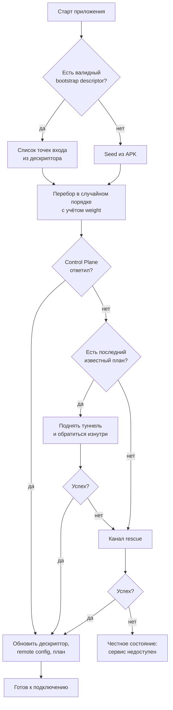
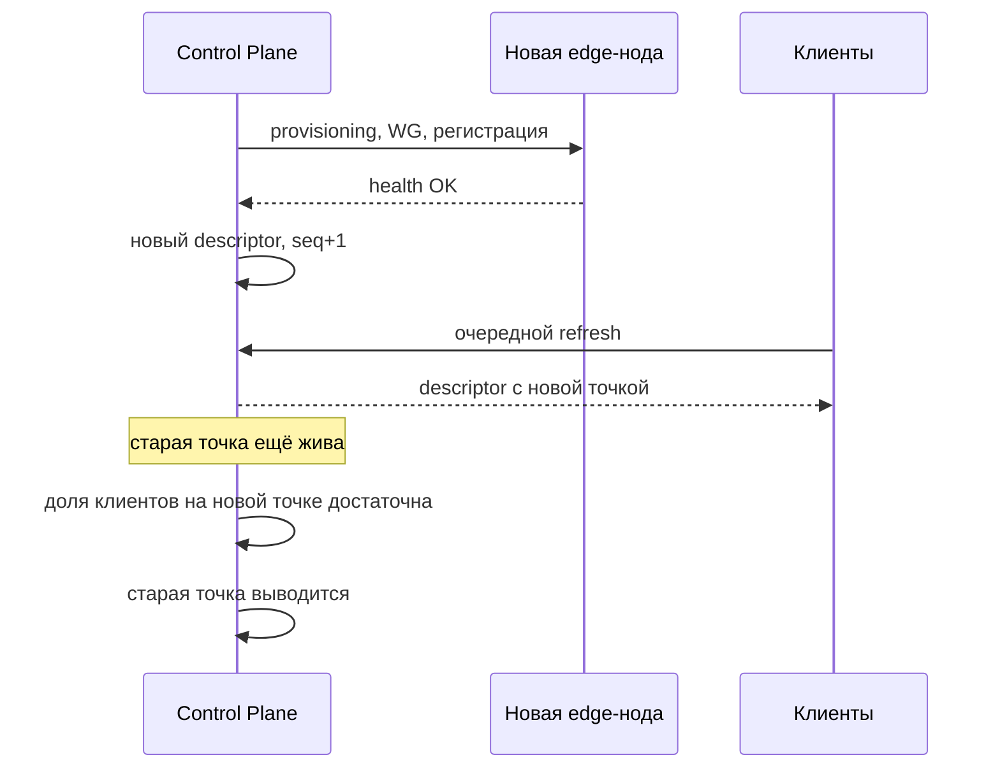

# Bootstrap And Recovery

Самый уязвимый момент системы — не туннель, а первый шаг: как приложение вообще находит Control Plane, если его домен заблокирован. Документ отвечает на два вопроса ТЗ: `восстановление без выпуска нового APK` и `быстрая замена IP и nodes`.

## Проблема

```
Нет связи с Control Plane
↓
Нет плана
↓
Нет туннеля
↓
Пользователь видит нерабочее приложение
```

При этом обновление APK — медленный путь: сборка, распространение, установка пользователем. Архитектура обязана уметь восстанавливаться быстрее, чем распространяется новая сборка.

## Четыре Независимых Канала Входа

Каналы упорядочены по цене и скорости, а не по «надёжности»: любой из них может быть заблокирован, поэтому важна их независимость друг от друга.

| Канал | Что это | Против чего работает | Слабость |
| --- | --- | --- | --- |
| `https-direct` | Прямой HTTPS к домену Control Plane | Обычная работа | Падает первым при блокировке домена |
| `reality-edge` | Edge-нода с VLESS + REALITY, проксирующая API Control Plane внутрь по WireGuard | Блокировка домена и DPI | IP может быть заблокирован |
| `tunnel` | Обращение к Control Plane изнутри уже поднятого VPN-туннеля по последнему известному плану | Блокировка всех публичных точек входа | Требует хотя бы один работающий узел из старого плана |
| `rescue` | Подписанный дескриптор, опубликованный вне нашей инфраструктуры | Полная блокировка нашей инфраструктуры | Требует внешней площадки, решение Business Owner |

Независимость означает конкретное: разные домены у разных регистраторов, разные ASN, разные провайдеры, разные подсети. Четыре точки входа в одной подсети — это одна точка входа.

## Bootstrap Descriptor

Подписанный документ, задающий актуальные точки входа. Обновляется удалённо, чем и обеспечивается восстановление без новой сборки.

```json
{
  "v": 1,
  "seq": 9,
  "issued_at": "2026-08-21T10:00:00Z",
  "valid_until": "2026-09-20T10:00:00Z",
  "entries": [
    { "kind": "https-direct", "host": "api-a.example", "weight": 100 },
    { "kind": "https-direct", "host": "api-b.example", "weight": 100 },
    { "kind": "reality-edge", "host": "198.51.100.7", "port": 443,
      "server_name": "dest-a.example", "public_key": "base64...",
      "short_id": "0f1e2d3c", "weight": 50 },
    { "kind": "reality-edge", "host": "198.51.100.9", "port": 443,
      "server_name": "dest-b.example", "public_key": "base64...",
      "short_id": "4a5b6c7d", "weight": 50 }
  ],
  "refresh_after_s": 86400
}
```

Свойства:

- подписан тем же механизмом, что и остальные документы, см. [remote-config.md](remote-config.md)
- проверяется по `seq` на anti-rollback, чтобы противник не вернул клиента на заблокированный список
- содержимое дескриптора **публично по построению**: противник его получит. Ценность не в секретности, а в скорости замены
- в APK вшит только seed-набор, дальше живёт обновляемый дескриптор

## Seed В APK

Требования к тому, что зашивается в сборку:

- минимум четыре точки входа: не менее двух `https-direct` и не менее двух `reality-edge`
- разные регистраторы доменов, разные хостинг-провайдеры, разные ASN
- публичные ключи Control Plane для проверки подписи — минимум два, для ротации без пересборки
- никаких приватных ключей, токенов и секретов

Seed стареет: он останется в старых установках навсегда, поэтому seed-адреса должны быть теми, которые дешевле всего защищать и восстанавливать, а не самыми ценными активами.

## Алгоритм Клиента



Правила перебора:

- порядок случайный с учётом весов, а не фиксированный: одинаковый порядок у всех клиентов создаёт предсказуемую сигнатуру и концентрирует нагрузку
- у каждой попытки короткий таймаут; общий бюджет обхода ограничен, чтобы приложение не выглядело зависшим
- неудачи запоминаются локально и понижают приоритет точки на время, но не удаляют её навсегда
- результаты обхода отправляются в телеметрию при первой возможности: это основной сигнал о блокировках по сетевым сегментам

Последний пункт — важный побочный эффект: клиенты, у которых не получилось, становятся распределённым датчиком блокировок. При этом отправляется только результат по точке входа и класс сети, без IP клиента.

## Канал Tunnel Как Механизм Самовосстановления

Если у клиента есть старый план, а все публичные точки входа заблокированы, он поднимает туннель через ноду из старого плана и обращается к Control Plane изнутри туннеля. Это работает, потому что:

- ноды и Control Plane связаны management-сетью
- внутри туннеля доступ к API не зависит от блокировки публичных доменов
- план подписан, поэтому старый план остаётся доверенным носителем адресов

Отсюда следует требование к сроку жизни: `expires_at` плана не должен быть настолько коротким, чтобы канал `tunnel` переставал работать раньше, чем пользователь запустит приложение. Баланс задаётся `plan_refresh_after_s` и grace-периодом.

## Канал Rescue

Публикация подписанного дескриптора вне нашей инфраструктуры. Поскольку дескриптор подписан, площадка не обязана быть доверенной — достаточно, чтобы она была доступна.

Кандидаты и их выбор — решение Business Owner, см. `ADR-004` в [decisions.md](decisions.md). Архитектурные требования к любому варианту:

- площадка не должна быть связана с нашими доменами и не должна раскрывать инфраструктуру
- содержимое только подписанное, никакого исполняемого кода
- адрес площадки может быть в seed, потому что он публичен по построению

Пока канал не выбран, архитектура остаётся корректной: первые три канала работают, `rescue` описан как расширение.

## Ротация Точек Входа



Правило: новая точка входа вводится **до** вывода старой, а не после. Момент вывода определяется наблюдаемой долей клиентов, получивших новый дескриптор, а не расписанием.

## Что Обеспечивает Требование «Без Нового APK»

| Изменение | Требует новой сборки | Почему |
| --- | --- | --- |
| Замена IP или ноды | Нет | Приходит в плане |
| Замена домена Control Plane | Нет | Приходит в bootstrap descriptor |
| Замена edge-ноды | Нет | Приходит в bootstrap descriptor |
| Смена REALITY-профиля | Нет | Приходит в плане |
| Смена DNS или routing | Нет | Приходит в плане |
| Ротация ключа подписи | Нет, пока валиден второй вшитый ключ | В APK минимум два ключа |
| Смена алгоритма подписи | Да | Клиентский код |
| Новый транспорт или протокол | Да | Клиентский код |

Новая сборка остаётся необходимой только там, где меняется исполняемая логика. Всё, что является конфигурацией, обязано быть удалённо заменяемым.
