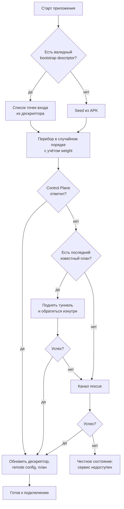
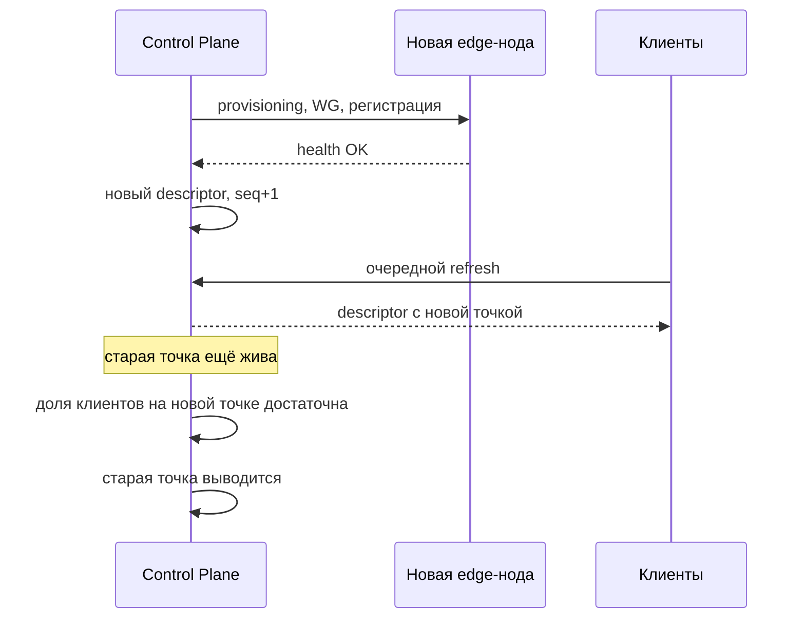

# Bootstrap And Recovery

Самый уязвимый момент системы — не туннель, а первый шаг: как приложение вообще находит Control Plane, если его домен заблокирован. Документ отвечает на два вопроса ТЗ: `восстановление без выпуска нового APK` и `быстрая замена IP и nodes`.

## Проблема

```
Нет связи с Control Plane
↓
Нет плана
↓
Нет туннеля
↓
Пользователь видит нерабочее приложение
```

При этом обновление APK — медленный путь: сборка, распространение, установка пользователем. Архитектура обязана уметь восстанавливаться быстрее, чем распространяется новая сборка.

## Публичные И Резервные Каналы Входа

Каналы упорядочены по цене и скорости, а не по «надёжности»: любой из них может быть заблокирован, поэтому важна их независимость друг от друга.

| Канал | Что это | Против чего работает | Слабость |
| --- | --- | --- | --- |
| `https-direct` | Прямой HTTPS к домену Control Plane | Обычная работа | Падает первым при блокировке домена |
| `https-ip` | Тот же HTTPS API по прямому IP с отдельным TLS server name | Блокировка или отравление DNS | Делит машину со стабильным доменом |
| `https-edge` | HTTPS reverse proxy на независимой VPN-ноде и отдельном домене/path prefix | Блокировка домена и адреса Core | Доступен, пока доступна конкретная edge-нода |
| `tunnel` | Обращение к Control Plane изнутри уже поднятого VPN-туннеля по последнему известному плану | Блокировка всех публичных точек входа | Требует хотя бы один работающий узел из старого плана |
| `rescue` | Подписанный дескриптор вне нашей инфраструктуры: зеркала и код восстановления | Полная блокировка нашей инфраструктуры, включая первую установку | Зеркала могут быть заблокированы; код требует действия пользователя |

Независимость означает конкретное: разные домены у разных регистраторов, разные ASN, разные провайдеры, разные подсети. Четыре точки входа в одной подсети — это одна точка входа.

## Bootstrap Descriptor

Подписанный документ, задающий актуальные точки входа. Обновляется удалённо, чем и обеспечивается восстановление без новой сборки.

```json
{
  "v": 1,
  "seq": 9,
  "issued_at": "2026-08-21T10:00:00Z",
  "valid_until": "2026-09-20T10:00:00Z",
  "entries": [
    { "kind": "https-direct", "host": "api-a.example", "weight": 100 },
    { "kind": "https-ip", "host": "198.51.100.7", "port": 443,
      "server_name": "api-a.example", "weight": 80 },
    { "kind": "https-edge", "host": "edge-a.example", "port": 443,
      "path_prefix": "/opaque-a", "weight": 60 },
    { "kind": "https-edge", "host": "edge-b.example", "port": 443,
      "path_prefix": "/opaque-b", "weight": 60 }
  ],
  "refresh_after_s": 86400
}
```

Свойства:

- подписан тем же механизмом, что и остальные документы, см. [remote-config.md](remote-config.md)
- проверяется по `seq` на anti-rollback, чтобы противник не вернул клиента на заблокированный список
- содержимое дескриптора **публично по построению**: противник его получит. Ценность не в секретности, а в скорости замены
- в APK вшит только seed-набор, дальше живёт обновляемый дескриптор

## Seed В APK

Требования к тому, что зашивается в сборку:

- стабильный `https-direct` и его `https-ip` должны позволять первой установке обойти отказ DNS
- независимые `https-edge` приходят в подписанном descriptor и меняются без выпуска APK
- публичные ключи Control Plane для проверки подписи — минимум два, для ротации без пересборки
- никаких приватных ключей, токенов и секретов

Seed стареет: он останется в старых установках навсегда, поэтому seed-адреса должны быть теми, которые дешевле всего защищать и восстанавливать, а не самыми ценными активами.

## Алгоритм Клиента



Правила перебора:

- порядок случайный с учётом весов, а не фиксированный: одинаковый порядок у всех клиентов создаёт предсказуемую сигнатуру и концентрирует нагрузку
- у каждой попытки короткий таймаут; общий бюджет обхода ограничен, чтобы приложение не выглядело зависшим
- неудачи запоминаются локально и понижают приоритет точки на время, но не удаляют её навсегда
- помимо рабочего обхода выполняется отдельный bounded sweep каждого entry напрямую из сети устройства; иначе первый ответивший путь навсегда скрывал бы состояние остальных
- результаты sweep отправляются при первой возможности: только публичный host нашего entry, успех и latency, без IP устройства и без адресов пользовательского трафика

Последние пункты делают клиентов распределённым датчиком блокировок. Core дополнительно сверяет target с собственной allowlist включённых entry, поэтому изменённый APK не может записать в эту таблицу произвольный посещённый домен.

## Канал Tunnel Как Механизм Самовосстановления

Если у клиента есть старый план, а все публичные точки входа заблокированы, он поднимает туннель через ноду из старого плана и обращается к Control Plane изнутри туннеля. Это работает, потому что:

- ноды и Control Plane связаны management-сетью
- внутри туннеля доступ к API не зависит от блокировки публичных доменов
- план подписан, поэтому старый план остаётся доверенным носителем адресов

Отсюда следует требование к сроку жизни: `expires_at` плана не должен быть настолько коротким, чтобы канал `tunnel` переставал работать раньше, чем пользователь запустит приложение. Баланс задаётся `plan_refresh_after_s` и grace-периодом.

## Канал Rescue

Business Owner зафиксировал требование: **до публичного запуска новый пользователь должен иметь возможность получить рабочую конфигурацию в первый раз даже при блокировке основных каналов.** Это делает `rescue` обязательным элементом запуска, а не расширением, см. `ADR-004` в [decisions.md](decisions.md).

Канал закрывает единственный сценарий, недоступный остальным каналам: **первая установка**, когда у клиента ещё нет ни одного плана, а `https-direct`, `https-ip` и `https-edge` заблокированы. У существующих пользователей эту роль играет канал `tunnel`.

### Два уровня

| Уровень | Механизм | Действие пользователя | Зависимость от нашей инфраструктуры |
| --- | --- | --- | --- |
| `rescue-mirror` | Подписанный дескриптор на нескольких независимых внешних площадках | Нет, приложение обходит их само | Нулевая: площадки чужие |
| `rescue-code` | Подписанный дескриптор, свёрнутый в короткий код или QR | Вставить код или снять QR один раз | Нулевая: доставка любым каналом |

Оба уровня отдают один и тот же подписанный документ и проходят ту же проверку подписи, что и остальные каналы. Именно подпись делает недоверенную площадку допустимой: подменить содержимое нельзя, можно только сделать его недоступным.

### `rescue-mirror`

Дескриптор публикуется как статический файл на нескольких площадках, не связанных с нашими доменами: объектное хранилище у стороннего провайдера, статический хостинг, публичные площадки для статики. Требования:

- минимум три площадки в разных юрисдикциях и у разных операторов
- только статическое подписанное содержимое, никакого исполняемого кода
- адреса площадок входят в seed APK и в дескриптор — они публичны по построению
- обновление площадок автоматизировано: публикация нового дескриптора выполняется тем же процессом, что и ротация точек входа

Выбор конкретных площадок — операционное решение, см. [prerequisites.md](prerequisites.md). Их блокировка не ломает механизм: он рассчитан на то, что часть площадок недоступна.

### `rescue-code`

Последний рубеж, работающий даже когда недоступно вообще всё, что принадлежит нам или на что мы влияем. Подписанный дескриптор сжимается и кодируется в короткую строку либо QR. Распространяться может любым каналом: поддержка, мессенджер, публикация, устная передача.

Свойства:

- содержит только точки входа, никаких секретов и никаких пользовательских данных
- проверяется подписью, поэтому его можно передавать через любой недоверенный канал
- одноразовость не требуется: код публичен по смыслу
- имеет `valid_until`, чтобы устаревшие коды не возвращали пользователей на мёртвые адреса

### Конфликт с требованием простоты UX

ТЗ требует, чтобы пользователь не импортировал конфигурации. `rescue-code` формально это нарушает, поэтому ограничен жёстко:

- экран ввода **не существует в обычном потоке** и не доступен из меню
- он появляется только после того, как исчерпаны все автоматические каналы
- формулировка описывает действие, а не технологию: пользователь вводит «код восстановления», а не конфигурацию VPN
- код не содержит ни UUID, ни параметров протокола в видимом пользователю смысле — это точки входа, дальше всё как обычно

Размен принят осознанно: альтернатива — новый пользователь при массовой блокировке не может начать пользоваться сервисом вообще.

## Ротация Точек Входа



Правило: новая точка входа вводится **до** вывода старой, а не после. Момент вывода определяется наблюдаемой долей клиентов, получивших новый дескриптор, а не расписанием.

## Что Обеспечивает Требование «Без Нового APK»

| Изменение | Требует новой сборки | Почему |
| --- | --- | --- |
| Замена IP или ноды | Нет | Приходит в плане |
| Замена домена Control Plane | Нет | Приходит в bootstrap descriptor |
| Замена edge-ноды | Нет | Приходит в bootstrap descriptor |
| Смена REALITY-профиля | Нет | Приходит в плане |
| Смена DNS или routing | Нет | Приходит в плане |
| Ротация ключа подписи | Нет, пока валиден второй вшитый ключ | В APK минимум два ключа |
| Смена алгоритма подписи | Да | Клиентский код |
| Новый транспорт или протокол | Да | Клиентский код |

Новая сборка остаётся необходимой только там, где меняется исполняемая логика. Всё, что является конфигурацией, обязано быть удалённо заменяемым.
