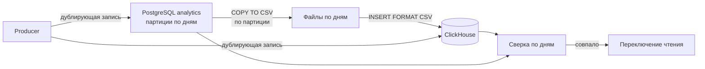

# Deferred Stack Migration

ClickHouse и Loki исключены из MVP по бюджету, `ADR-018` и `ADR-019`. Business Owner поставил условие: переход на них должен быть возможен без потери накопленной истории.

Документ описывает не «как мы когда-нибудь мигрируем», а **что нужно соблюдать сегодня, чтобы миграция позже была механической**. Ограничения этого документа обязательны с первой строки кода, ровно как инварианты в [evolution.md](evolution.md).

Причина проста: данные, записанные в неподходящей форме, нельзя переписать задним числом. Формат хранения — единственное решение, которое нельзя отложить.

---

## Часть 1. Аналитика: PostgreSQL → ClickHouse

### Что заменяет ClickHouse на MVP

Отдельная база `analytics` на том же экземпляре PostgreSQL, с отдельной ролью, не имеющей доступа к таблицам аккаунтов.

### Инварианты схемы, обязательные сейчас

**А-1. Только вставка.** Таблицы аналитики append-only. Никаких `UPDATE`, никаких `DELETE`, кроме применения retention целыми партициями. ClickHouse построен вокруг вставки; любая логика, опирающаяся на обновление строк, при переносе не выживет.

**А-2. Имена и типы колонок совпадают с целевыми в ClickHouse.** Схема в PostgreSQL пишется как зеркало будущей таблицы ClickHouse, а не как удобная реляционная модель. Соответствие типов фиксируется таблицей ниже и не меняется без обновления обеих сторон.

**А-3. Партиционирование по дню, по колонке времени события.** В PostgreSQL — декларативное партиционирование по `RANGE` на день. Это даёт и дешёвый retention, и естественную единицу переноса: одна партиция — один файл — одна идемпотентная загрузка.

**А-4. Никаких внешних ключей и никаких соединений с таблицами аккаунтов.** Это уже требование [privacy-model.md](privacy-model.md), но здесь оно ещё и техническое: в ClickHouse внешних ключей нет.

**А-5. Никаких `SERIAL` и последовательностей в качестве смысловых идентификаторов.** Порядок вставки не является данными. Уникальность строки определяется естественным ключом: `analytics_id`, время, измерение.

**А-6. Без `NULL`, где можно обойтись значением по умолчанию.** В ClickHouse `Nullable` стоит дороже и меняет семантику агрегатов.

**А-7. Время только в UTC, `timestamptz`.** Локальные зоны в аналитике не хранятся.

**А-8. Низкокардинальные поля — обычный `text`, а не `ENUM` PostgreSQL.** Добавление значения в PG-энум требует DDL и блокировок, а при выгрузке энум всё равно становится текстом. В ClickHouse это станет `LowCardinality(String)`.

### Соответствие типов

| Поле | PostgreSQL | ClickHouse | Примечание |
| --- | --- | --- | --- |
| `analytics_id` | `bytea` фиксированно 16 байт | `FixedString(16)` | Не `uuid`: это не UUID, а усечённый HMAC |
| `cohort` | `text` | `LowCardinality(String)` | Месяц регистрации |
| `ts`, `bucket_ts` | `timestamptz` | `DateTime('UTC')` | Ключ партиционирования |
| `node_alias`, `segment_class`, `class`, `entry_kind`, `transport_kind`, `app_version`, `tier`, `event`, `result`, `end_reason` | `text` | `LowCardinality(String)` | |
| `session_id` | `uuid` | `UUID` | |
| `bytes_up`, `bytes_down` | `bigint` | `UInt64` | |
| `flows`, `duration_s`, `latency_ms` | `integer` | `UInt32` | |
| `active_s` | `smallint` | `UInt16` | |

Отрицательных значений в этих полях не бывает, поэтому знаковые типы PostgreSQL отображаются в беззнаковые ClickHouse. Приложение обязано это гарантировать: отрицательное значение в счётчике — ошибка producer, а не данные.

### Процедура переноса



Шаги:

1. Поднять ClickHouse, создать таблицы с теми же именами и типами.
2. Включить **дублирующую запись**: producer пишет и в PostgreSQL, и в ClickHouse. Период — не менее 7 суток.
3. Перенести историю по одной суточной партиции: выгрузка `COPY ... TO STDOUT WITH (FORMAT csv)`, загрузка `INSERT ... FORMAT CSV`.
4. Сверить каждый день по трём величинам: число строк, сумма `bytes_up + bytes_down`, число уникальных `analytics_id`.
5. Переключить чтение: источник данных Grafana на ClickHouse.
6. Выключить запись в PostgreSQL, оставить базу доступной только на чтение на срок отката.
7. Удалить аналитическую базу PostgreSQL после истечения срока отката.

**Идемпотентность.** Перед загрузкой суток в ClickHouse партиция за эти сутки удаляется целиком: `ALTER TABLE ... DROP PARTITION`. Повторный запуск переноса даёт тот же результат, а не удвоенные строки. Это единственный способ безопасно перезапускать миграцию после сбоя посередине.

**Критерий отказа.** Если сверка не сходится хотя бы за одни сутки — переключение чтения не выполняется. Расхождение разбирается, а не округляется.

**Откат.** До шага 7 откат — это переключение источника данных обратно. После шага 7 отката нет, поэтому шаг 7 выполняется отдельно и позже остальных.

---

## Часть 2. Логи: journald и архив в Spaces → Loki

### Что заменяет Loki на MVP

Логи пишутся в journald на каждом хосте. Поскольку на дроплетах 512 MB и 10 GB диска journald ротируется быстро, логи выгружаются в Spaces под префикс `logs/`.

Архив существует, чтобы не терять логи между ротациями, а **не чтобы удлинить срок хранения**. Срок остаётся прежним — 14 суток, как в [privacy-model.md](privacy-model.md).

### Инварианты формата, обязательные сейчас

**Л-1. Только структурированный JSON, никогда не бинарный экспорт journald.** Выгрузка выполняется как `journalctl -o json`, по строке на запись. Бинарный формат journald привязан к машине и версии и не импортируется в Loki.

**Л-2. Набор меток фиксируется сейчас и совпадает с будущими метками Loki.** Метки: `host_role` (`core`, `obs`, `vpn`, `edge`, `probe`), `node_alias`, `unit`, `level`. Все низкокардинальные.

Это самый важный инвариант части. В Loki метка с большим числом значений разрушает индекс, а сменить набор меток задним числом означает переиндексировать весь архив. Ни `session_id`, ни `analytics_id`, ни адреса, ни идентификаторы запросов метками не становятся никогда.

**Л-3. Путь в Spaces кодирует метки и время:**

```
logs/<host_role>/<node_alias>/<YYYY>/<MM>/<DD>/<unit>-<HH>.json.gz
```

Один файл — один час одного юнита одного хоста. Отсюда следуют две вещи: импорт восстанавливает метки из пути без разбора содержимого, и повторная загрузка часа заменяет ровно этот час.

**Л-4. Приватность архива равна приватности логов.** Правила [privacy-model.md](privacy-model.md) действуют без исключений: ни destination, ни SNI, ни DNS-имён, ни email, ни полных токенов. Архив не является «местом, где можно оставить чуть больше».

**Л-5. Retention архива обеспечивает само задание выгрузки.** Lifecycle-правила bucket недоступны, см. [../integrations/digitalocean.md](../integrations/digitalocean.md), поэтому задание удаляет объекты старше 14 суток при каждом запуске. Retention, зависящий от прав, которых нет, — это отсутствие retention.

### Процедура переноса

1. Поднять Loki и promtail.
2. **Поднять `reject_old_samples_max_age` в конфигурации Loki** на срок, покрывающий возраст архива, минимум 15 суток.
3. Скачать архив из Spaces в промежуточный каталог.
4. Скормить файлы promtail с метками, восстановленными из пути.
5. Сверить: число строк в архиве за сутки равно числу записей в Loki за те же сутки по тем же меткам.
6. Переключить текущую отправку логов на Loki, оставив выгрузку в Spaces как резервный канал.

**Главная ловушка, ради которой написан пункт 2.** По умолчанию Loki отбрасывает записи старше `reject_old_samples_max_age`, и делает это **молча** с точки зрения оператора: импорт «проходит», а данных нет. Если не поднять порог заранее, историю можно потерять, будучи уверенным, что она загружена. Именно поэтому пункт 5 — сверка, а не осмотр дашборда.

---

## Что Проверяется Автоматически Уже Сейчас

Инварианты, которые нельзя проверить, не соблюдаются. На стадии реализации обязательны:

- тест схемы аналитики: отсутствие `ENUM`, отсутствие внешних ключей, наличие партиционирования по дню
- тест producer: попытка `UPDATE` или `DELETE` строки аналитики вне retention завершается ошибкой
- тест выгрузки логов: результат — валидный JSON по строке на запись, набор меток совпадает с зафиксированным
- тест retention: объекты старше окна удаляются заданием, а не остаются в расчёте на lifecycle

## Триггеры Перехода

| Компонент | Триггер |
| --- | --- |
| ClickHouse | Аналитические запросы перестают укладываться в допустимое время на доступном железе, либо появляется бюджет на отдельный хост |
| Loki | Первый инцидент, разбор которого потребовал одновременного просмотра логов более чем двух хостов |

До наступления триггера переход не выполняется. Соблюдение инвариантов выше — не подготовка к переходу, а условие, при котором он останется возможным.
