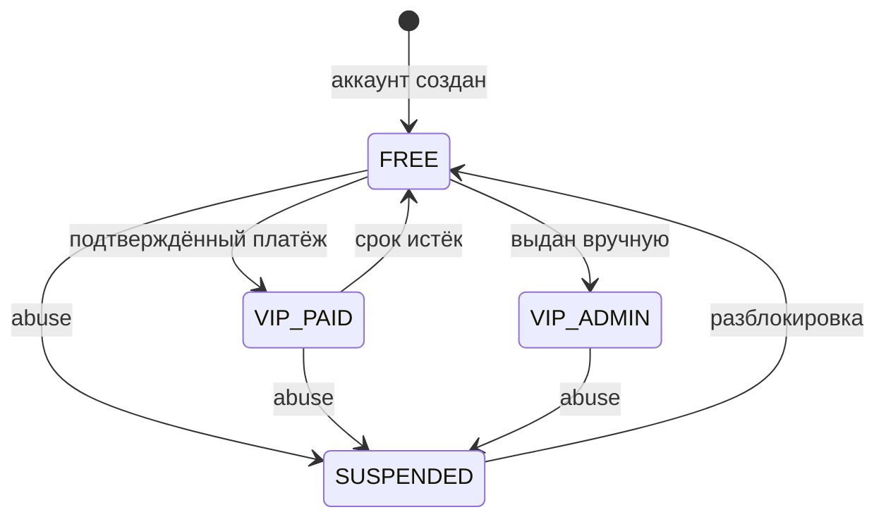
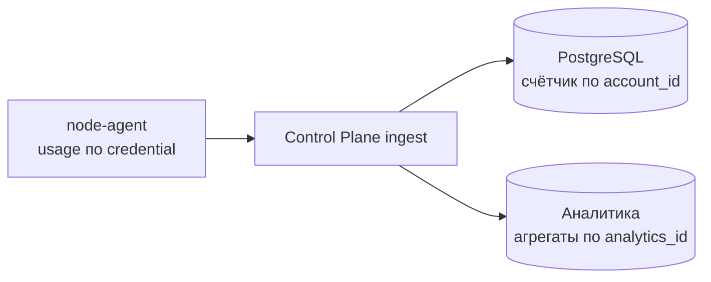

# Entitlement Model

Документ описывает, чем FREE отличается от VIP, как покупка выдаёт срочный доступ и как ограничения применяются технически. Платёжное решение зафиксировано в `ADR-030` в [decisions.md](decisions.md).

## Принцип

Entitlement — серверный атрибут аккаунта. Клиент его не вычисляет, не хранит как источник истины и не может изменить.

FREE и VIP не различаются качеством инфраструктуры. И те и другие ноды — расходный ресурс с одинаковым жизненным циклом, см. [node-lifecycle.md](node-lifecycle.md). Действующие значения лимитов читаются в [BO-инструкции](../business-owner-operations.md#free-и-vip) и live panel; здесь описываются точки применения.

## Различия

| Параметр | FREE | VIP |
| --- | --- | --- |
| Квота трафика за период | Не применяется | Не применяется |
| Скорость **трафика через VPN** | 10 Мбит/с | Без ограничения продукта |
| Установки приложения | 1 | Без предела |
| Внешние устройства/клиенты | Нет | Без предела |

И больше ничем. Ни приоритета при распределении, ни выделенных нод, ни отдельного качества связи. Это сознательное решение: любое различие в инфраструктуре пришлось бы поддерживать в Fleet manager, в мониторинге и в диагностике, а платит за него пользователь одинаково расходуемым ресурсом.

**Значения — серверная конфигурация, а не код Android.** Они меняются без выпуска APK, потому что ограничения применяются Core и нодой.

### Статус квоты трафика

Ранний sizing использовал 20 GiB/мес как гипотезу бюджета, но Business Owner не утверждал это действующим продуктовым лимитом и enforcement не реализован. Поэтому текущее значение — «не применяется». Ввод квоты требует отдельного решения, реализации серверного счётчика/enforcement и обновления BO-инструкции; старый расчёт сам по себе ничего не ограничивает.

### Как ограничивается скорость

Xray-core **не умеет ограничивать полосу на пользователя**. Встроенного механизма нет, и притворяться, что есть, нельзя.

Рабочий подход: маршрутизация по пользователю на отдельный outbound с собственной меткой пакетов, и шейпинг ядром по этой метке.

```
Xray routing: user -> outbound tag
outbound.streamSettings.sockopt.mark = N
    |
    v
tc HTB: класс на метку N, ceil из server policy
```

Что это даёт: ограничение действует на аккаунт, а не на устройство или адрес, и переживает NAT. При 50 пользователях речь идёт о полусотне классов `tc` — нагрузка, незаметная для ядра.

Рассмотренные и отвергнутые варианты:

| Вариант | Почему отвергнут |
| --- | --- |
| Шейпинг по адресу источника | Ограничивает устройство, а не аккаунт; ломается за NAT; требует от ноды знать адреса, что противоречит [privacy-model.md](privacy-model.md) |
| Отдельный порт на пользователя | Раскрывает число пользователей ноды сканированием портов |
| Ограничение на клиенте | Клиент не является точкой контроля, `ADR-001` |

Механизм проверен на реальной ноде для действующего FREE limit. Изменение значения остаётся server-side раскаткой; Android в enforcement не участвует.

### Чего Лимит Не Касается

Шейпер видит пакеты с меткой. Метку ставит Xray **на ноде**. Значит трафик, не заходящий на ноду, не ограничивается вообще — и это не дыра, а граница.

Прямой список при `russia_direct` уходит с устройства напрямую. Поэтому замер на зарубежном сервисе покажет FREE-лимит, а замер на российском — скорость домашнего канала. Оба числа верные и означают разное.

Граница намеренная, и каждая альтернатива хуже:

- лимит существует, чтобы ограничить **наш** расход; прямой трафик нам ничего не стоит;
- прямой список — это банки и госуслуги, и замедлять их до 10 Мбит/с значило бы ухудшать ровно то, ради чего список заведён;
- завести российский трафик в туннель, чтобы он ограничивался, значит **увеличить** нашу полосу ради того, чтобы её ограничить;
- шейпить на устройстве отвергнуто выше и по отдельной причине: клиент не является точкой контроля, `ADR-001`.

Практическое следствие, которое стоит держать в голове при разговоре о цене: **пользователю, чей трафик преимущественно российский, FREE ощущается почти безлимитным**, и «без ограничения скорости» покупает для него меньше, чем читается по таблице. Это свойство продукта, а не дефект, и обнаруживается оно первым же спидтестом.

## Состояния



В базе оба варианта представлены `tier = VIP`. Различие только в `vip_expires_at`: у оплаченного VIP там срок, у административного — `null`. Отключение новых продаж не меняет ни один уже действующий VIP.

## Покупка И Срок

Core хранит серверный каталог; Android не передаёт цену, валюту или длительность. Текущие продукты:

| Product ID | Срок | Цена |
| --- | ---: | ---: |
| `vip_1_month` | 1 месяц | 399 ₽ |
| `vip_3_months` | 3 месяца | 1 090 ₽ |
| `vip_12_months` | 12 месяцев | 3 490 ₽ |

Покупка доступна только после существующего решения `purchase.Assess`: глобальный серверный switch продаж включён, аккаунт остаётся FREE и с момента регистрации прошло серверно заданное число дней (по умолчанию 7). Платёжный API повторяет эту проверку непосредственно перед созданием checkout, поэтому старый экран или изменённый APK её не обходят.

VIP включается только в транзакции обработки канонически подтверждённого платежа. Возврат браузера в приложение не является подтверждением. `entitlement_applied_at` и блокировка строки платежа делают повторный webhook безопасным: один платёж добавляет срок один раз.

Все пути VIP→FREE используют один транзакционный downgrade: истечение `vip_expires_at`, канонически успешный refund и operator-команды по email или безопасному account prefix. В той же транзакции Core отзывает active external credentials и применяет предел установок FREE. `LiveCredentials` и список credentials для шейпинга независимо соединяются с текущими `tier_limits`; external credential не выдаётся нодам, если `max_external = 0`, даже когда stale-строка ошибочно осталась `ACTIVE`. Исторические строки устройств сохраняются для аудита, но доступ по ним прекращается.

Продление действующего VIP, напоминания, скидки удержания, подписки и автоплатежи в текущий контракт не входят.

## Где Применяется Ограничение

| Точка | Что делает | Почему нужна |
| --- | --- | --- |
| Выдача плана | Число устройств, policy, доступность экспорта | Основной рычаг |
| Список credentials для ноды | Проверяет состояние credential и актуальный лимит типа устройства на тарифе | Защита от рассинхронизации tier и старой строки credential |
| Нода | Принимает только переданный Core `vpn_credential_id`; применяет шейпинг скорости к трафику, который через неё идёт | Отзыв после ближайшей полной синхронизации без ожидания Android refresh |
| Учёт квоты | Будущее отключение credential при исчерпании | Сейчас не реализован и не применяется |
| Клиент | Показывает состояние и доступные действия | Только отображение, не контроль |

Значения реализованных лимитов приходят на ноду в её конфигурации от Core и применяются node-agent. Изменение скорости — это server-side конфигурация и раскатка на ноды. Квота станет таким лимитом только после появления отдельного счётчика и enforcement.

Клиент не участвует в применении ограничений. Модифицированное приложение не получает больше прав, потому что права выдаются планом и credential, а не проверяются локально.

## Проект Учёта Трафика Для Будущих Квот

Если квота будет утверждена, ей потребуется отдельный от аналитики счётчик:



Два потребителя одного события. В базе аккаунтов копится только объём на аккаунт за период. В аналитической базе — обезличенные агрегаты. Связи между записями после обработки не остаётся.

Соблазн считать квоты по аналитическому хранилищу разрушил бы модель приватности: он потребовал бы постоянной связи `analytics_id → account_id`.

## Экспорт Конфигурации

VIP может получить конфигурацию для стороннего клиента. Это самая рискованная возможность продукта, потому что она выносит рабочий доступ за пределы нашего приложения.

### Что именно выдаётся

| Формат | Что это | Обновляется сервером |
| --- | --- | --- |
| Subscription URL | HTTPS-ссылка, по которой сторонний клиент периодически забирает актуальный конфиг | Да |
| QR | Тот же subscription URL в виде кода | Да, через ссылку |
| `vless://` URI | Снимок конкретной ноды | Нет |
| JSON | Снимок конфигурации Xray | Нет |

Основной формат — subscription URL. Причина принципиальная: сторонний клиент не умеет работать с нашим connection plan и не будет делать failover по нашим правилам. Subscription-ссылка возвращает ему актуальный набор нод, то есть сохраняет управление на сервере. Снимки `vless://` и JSON нужны для клиентов без поддержки подписок и устаревают при первой же замене ноды — это ограничение сообщается пользователю в момент выдачи, а не после поломки.

### Отдельный класс credential

Экспортируемый доступ выпускается как **отдельный `vpn_credential_id`**, а не тот же, что использует приложение.

Почему это обязательно:

- отзыв экспорта не должен обрывать сессию в приложении, и наоборот
- экспортированный доступ может быть опубликован пользователем — намеренно или по неосторожности, поэтому его риск-профиль другой
- учёт и лимиты по нему считаются отдельно

### Ограничение blast radius

Опубликованная в интернете subscription-ссылка раскрывает IP выданных нод кому угодно. Это не гипотеза: любая практика распространения конфигов заканчивается тем, что часть ссылок попадает в публичные каналы.

Контроли:

- экспортные credential выдаются из выделенного подмножества нод, `export`-пула. Раскрытие ссылки бьёт по нему, а не по нодам, обслуживающим приложение
- subscription URL содержит секретный токен, отзываемый в один клик из приложения
- запросы к subscription-эндпоинту ограничены по частоте; аномальная частота обращений — сигнал публикации ссылки
- всплеск числа различных источников по одному токену переводит его в состояние подозрения и предлагает пользователю перевыпуск
- экспортный credential имеет собственный предел одновременных подключений: без него VIP с одной ссылкой превращается в публичный сервис

Про приватность: обращение стороннего клиента к subscription-эндпоинту раскрывает Control Plane сетевой адрес источника. Этот адрес не сохраняется — применяется то же правило, что и к остальным точкам входа, см. [privacy-model.md](privacy-model.md).

### Что экспорт ломает и что с этим делается

| Свойство | Что происходит при экспорте | Компенсация |
| --- | --- | --- |
| Server-managed failover | Сторонний клиент не знает наших правил | Subscription-ссылка отдаёт актуальный набор нод |
| Progressive disclosure | Пользователь видит endpoint, UUID и transport params | Ограничено VIP/export flow; это осознанная плата за функцию |
| Простой UX | Появляется техническая сущность в интерфейсе | Экспорт — вторичный экран, а не основной путь. Кнопка `ON` остаётся единственным главным действием |
| Учёт устройств | Число устройств по экспорту неизмеримо точно | Предел одновременных подключений вместо счёта устройств |

## Злоупотребления

| Сценарий | Контроль |
| --- | --- |
| Один аккаунт на много людей | Лимит одновременных устройств, отзыв `device_id` |
| Публикация subscription-ссылки | Предел подключений, детект по числу источников, отзыв и перевыпуск токена |
| Массовая регистрация FREE ради нод | Rate limit, cooldown, exposure budget, `quarantine`-пул |
| Аномальный объём | Квота, при исчерпании — остановка credential |

## Что Требует Отдельного Решения Business Owner

- предел одновременных подключений по экспортному credential
- кому и на каких основаниях выдаётся административный VIP без срока
- изменение цен и продуктовой упаковки после проверки фактической конверсии и себестоимости
- нужна ли месячная квота трафика и каковы её значения
