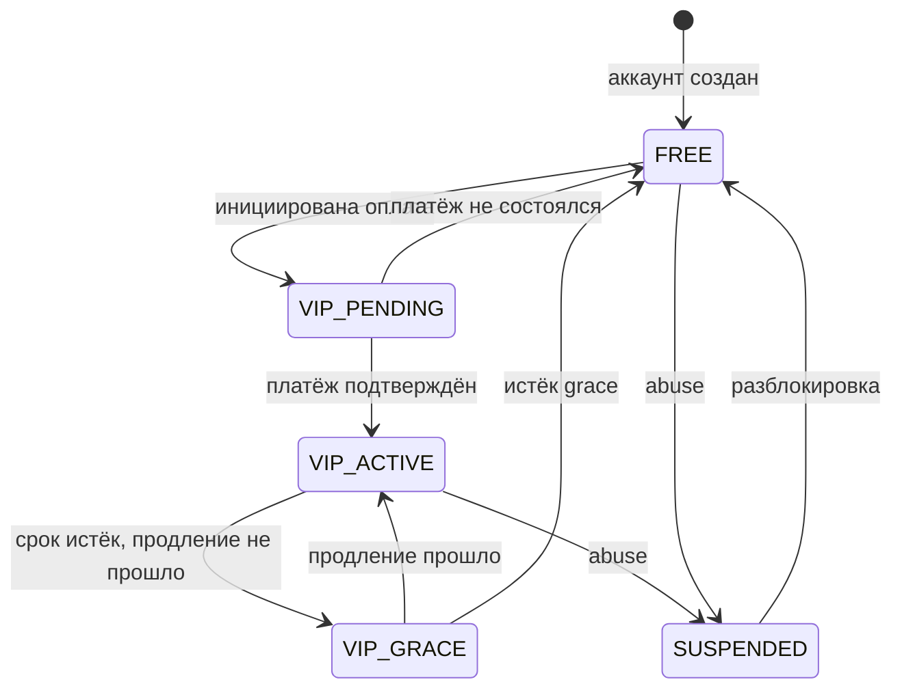
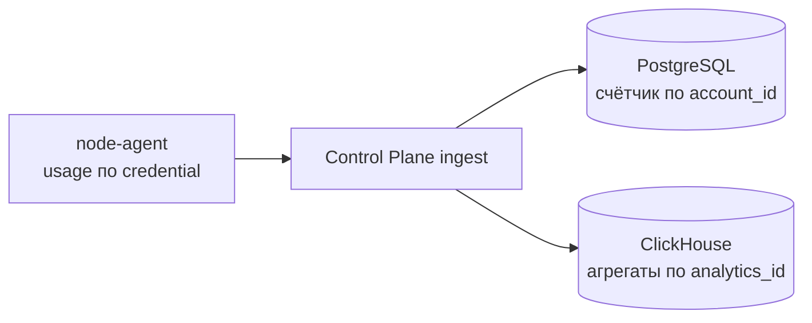
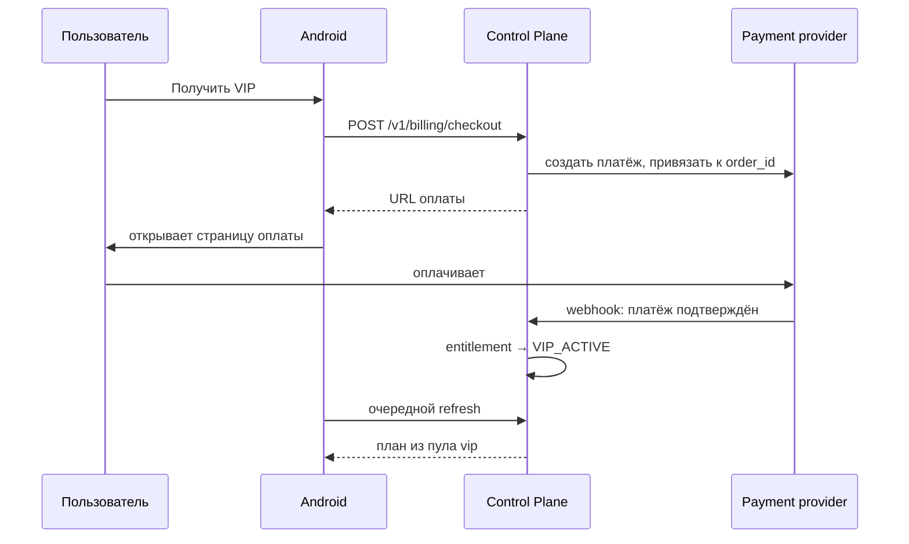

# Entitlement And Payment Model

Документ описывает, что отличает FREE от VIP, где это ограничение применяется технически и как устроен платёжный путь. Конкретные цены и лимиты — решение Business Owner; здесь фиксируется механика.

## Принцип

Entitlement — серверный атрибут аккаунта. Клиент его не вычисляет, не хранит как источник истины и не может изменить. В UI он проявляется ровно одним элементом: кнопкой `Получить VIP`.

## Уровни

| Свойство | FREE | VIP |
| --- | --- | --- |
| Пул нод | `free` | `vip` |
| Одновременных устройств | 1 | несколько, число задаётся конфигурацией |
| Месячная квота трафика | Ограничена | Существенно выше либо без явного потолка при fair use |
| Приоритет при распределении | Обычный | Повышенный, ноды с большим запасом ёмкости |
| Поведение при исчерпании квоты | Остановка с предложением VIP | Fair use, при аномалии — ручной разбор |

Разделение пулов — не маркетинг, а контроль безопасности из [threat-model.md](threat-model.md): разведка бесплатными аккаунтами не раскрывает платные мощности.

## Состояния

`VIP_GRACE` существует, чтобы сбой платёжного провайдера или банка не отключал оплатившего пользователя мгновенно. Длительность grace задаётся remote config.

## Где Применяется Ограничение

Три точки, и они не взаимозаменяемы:

| Точка | Что делает | Почему нужна |
| --- | --- | --- |
| Выдача плана | Выбирает пул, число устройств, policy | Основной рычаг: без плана нет подключения |
| Нода | Принимает или не принимает `vpn_credential_id` | Мгновенный отзыв доступа без ожидания refresh плана |
| Клиент | Показывает состояние и предложение VIP | Только отображение, не контроль |

Клиент не участвует в применении ограничений. Модифицированное приложение не получает больше прав, потому что права выдаются планом и credential, а не проверяются локально.

## Учёт Трафика Для Квот

Квота требует счётчика на аккаунт, и это отдельный от аналитики путь:

Два потребителя одного входящего события. В Postgres попадает только счётчик объёма на аккаунт за период — без классов трафика, времени сессий и любых поведенческих деталей. В ClickHouse попадает обезличенная аналитика. Связи между этими двумя записями после обработки не остаётся.

Это разделение важно: соблазн считать квоты по аналитическому хранилищу разрушил бы модель приватности, потому что потребовал бы связи `analytics_id → account_id` на постоянной основе.

## Платёжный Путь

Свойства:

- приложение не обрабатывает платёжные данные и не видит их
- подтверждение приходит серверным webhook, а не от клиента: клиентское «я оплатил» не является основанием
- webhook проверяется по подписи провайдера и идемпотентен по `order_id`
- переход на VIP-ноды происходит на ближайшем refresh плана, а не мгновенно; при необходимости Control Plane может укоротить TTL плана для этого аккаунта

## Ограничение, Влияющее На Выбор Провайдера

Приложение распространяется как подписанный APK и через Firebase App Distribution, то есть вне Google Play. Из этого следует:

- Google Play Billing неприменим
- оплата идёт через внешнюю платёжную страницу, а не через биллинг магазина
- если в будущем появится дистрибуция через Play, правила магазина по in-app purchases потребуют пересмотра платёжной схемы. Это известное ограничение, а не упущение

Выбор конкретного платёжного провайдера для российского рынка — решение Business Owner, `ADR-006` в [decisions.md](decisions.md). Архитектурные требования к любому кандидату: серверные webhook с подписью, идемпотентность, возвраты, отсутствие необходимости передавать провайдеру что-либо, кроме `order_id` и суммы.

## Привязка Оплаты К Аккаунту

Оплата инициируется уже авторизованным пользователем, поэтому `order_id` создаётся сервером и жёстко связан с `account_id`. Платёжной странице не передаётся ни email, ни какие-либо VPN-идентификаторы, кроме случая, когда провайдер требует email для чека — тогда используется email аккаунта и только для этой цели.

## Злоупотребления

| Сценарий | Контроль |
| --- | --- |
| Один аккаунт на много людей | Лимит одновременных устройств, отзыв `device_id` |
| Массовая регистрация FREE ради нод | Rate limit, cooldown, exposure budget, пул `quarantine` |
| Аномальный объём у VIP | Fair use, ручной разбор, отдельный пул для тяжёлых пользователей |
| Возвратные платежи | Идемпотентная обработка, перевод в `FREE` при chargeback |

## Что Остаётся За Business Owner

- цена VIP и период подписки
- размер квоты FREE
- число устройств для VIP
- платёжный провайдер
- политика возвратов

Ни одно из этих значений не зашивается в код: все они — конфигурация, применяемая сервером.
