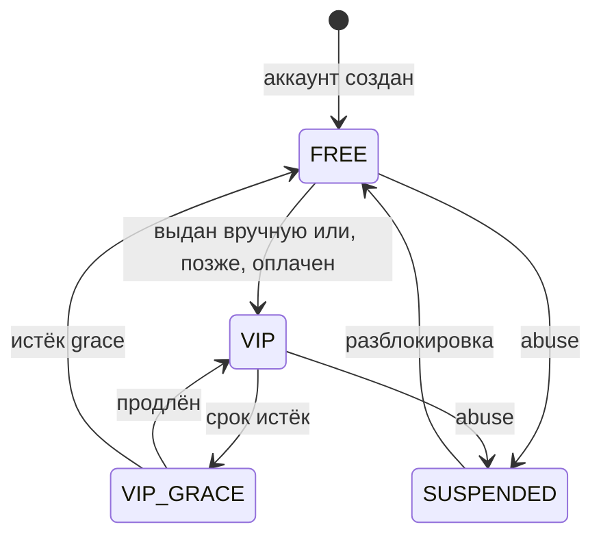
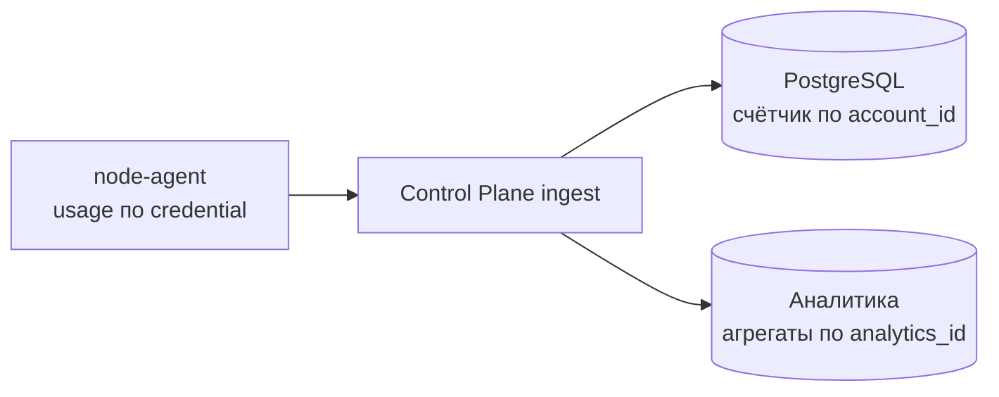

# Entitlement Model

Документ описывает, чем FREE отличается от VIP и как это применяется технически. Оплата в MVP не реализуется, см. `ADR-006` в [decisions.md](decisions.md).

## Принцип

Entitlement — серверный атрибут аккаунта. Клиент его не вычисляет, не хранит как источник истины и не может изменить.

FREE и VIP не различаются качеством инфраструктуры. И те и другие ноды — расходный ресурс с одинаковым жизненным циклом, см. [node-lifecycle.md](node-lifecycle.md). Различия исчерпываются тремя параметрами.

## Различия

| Параметр | FREE | VIP |
| --- | --- | --- |
| Квота трафика за период | 20 GiB/мес | Существенно выше |
| Скорость | 20 Мбит/с | Не ограничена на MVP |
| Одновременных устройств | 1 | Несколько, число задаётся конфигурацией |
| Экспорт конфигурации для сторонних клиентов | Нет | Да: subscription-ссылка, QR, JSON |

И больше ничем. Ни приоритета при распределении, ни выделенных нод, ни отдельного качества связи. Это сознательное решение: любое различие в инфраструктуре пришлось бы поддерживать в Fleet manager, в мониторинге и в диагностике, а платит за него пользователь одинаково расходуемым ресурсом.

**Все четыре значения — конфигурация, а не код.** Требование Business Owner: параметры меняются серверно, без выпуска новой сборки приложения. Это выполнимо, потому что ни одно ограничение не применяется на клиенте, см. таблицу точек применения ниже.

### Откуда берётся 20 GiB

Не из продуктовых соображений. Пул исходящего трафика при утверждённой топологии — 3500 GiB, см. [mvp-topology.md](mvp-topology.md). При 50 пользователях квота 20 GiB даёт максимум 1000 GiB, то есть выход за бюджет физически невозможен. Квота здесь — механизм соблюдения бюджета, и менять её нужно вместе с пересчётом пула.

### Как ограничивается скорость

Xray-core **не умеет ограничивать полосу на пользователя**. Встроенного механизма нет, и притворяться, что есть, нельзя.

Рабочий подход: маршрутизация по пользователю на отдельный outbound с собственной меткой пакетов, и шейпинг ядром по этой метке.

```
Xray routing: user -> outbound tag
outbound.streamSettings.sockopt.mark = N
    |
    v
tc HTB: класс на метку N, ceil 20 Mbit
```

Что это даёт: ограничение действует на аккаунт, а не на устройство или адрес, и переживает NAT. При 50 пользователях речь идёт о полусотне классов `tc` — нагрузка, незаметная для ядра.

Рассмотренные и отвергнутые варианты:

| Вариант | Почему отвергнут |
| --- | --- |
| Шейпинг по адресу источника | Ограничивает устройство, а не аккаунт; ломается за NAT; требует от ноды знать адреса, что противоречит [privacy-model.md](privacy-model.md) |
| Отдельный порт на пользователя | Раскрывает число пользователей ноды сканированием портов |
| Ограничение на клиенте | Клиент не является точкой контроля, `ADR-001` |

**Статус механизма: требует проверки на реальной ноде.** Схема опирается на поддержку `sockopt.mark` в outbound Xray и на маршрутизацию по полю пользователя. Оба механизма документированы, но связка целиком на нашей конфигурации не проверялась. Проверка входит в задачу развёртывания первой VPN-ноды, и её результат может изменить выбор варианта.

Пока проверка не пройдена, ограничение скорости считается незакрытым требованием, а не реализованным.

## Состояния



В MVP переход `FREE → VIP` выполняется только административно: тестерам, ранним пользователям, по решению Business Owner. Платёжный путь добавляется позже и подключается к этому же переходу, не меняя остальной модели.

## Где Применяется Ограничение

| Точка | Что делает | Почему нужна |
| --- | --- | --- |
| Выдача плана | Число устройств, policy, доступность экспорта | Основной рычаг |
| Нода | Принимает или не принимает `vpn_credential_id`; применяет шейпинг скорости | Мгновенный отзыв без ожидания refresh |
| Учёт квоты | Отключение credential при исчерпании | Единственный способ остановить трафик |
| Клиент | Показывает состояние и доступные действия | Только отображение, не контроль |

Значения лимитов приходят на ноду в её конфигурации от Control Plane и применяются node-agent. Изменение квоты или скорости — это изменение конфигурации и её раскатка на ноды, не затрагивающая приложение. Именно поэтому требование «менять серверно без релиза» выполняется: ни одно из четырёх значений не существует в коде клиента.

Клиент не участвует в применении ограничений. Модифицированное приложение не получает больше прав, потому что права выдаются планом и credential, а не проверяются локально.

## Учёт Трафика Для Квот

Квота требует счётчика на аккаунт, и это отдельный от аналитики путь:



Два потребителя одного события. В базе аккаунтов копится только объём на аккаунт за период. В аналитической базе — обезличенные агрегаты. Связи между записями после обработки не остаётся.

Соблазн считать квоты по аналитическому хранилищу разрушил бы модель приватности: он потребовал бы постоянной связи `analytics_id → account_id`.

## Экспорт Конфигурации

VIP может получить конфигурацию для стороннего клиента. Это самая рискованная возможность продукта, потому что она выносит рабочий доступ за пределы нашего приложения.

### Что именно выдаётся

| Формат | Что это | Обновляется сервером |
| --- | --- | --- |
| Subscription URL | HTTPS-ссылка, по которой сторонний клиент периодически забирает актуальный конфиг | Да |
| QR | Тот же subscription URL в виде кода | Да, через ссылку |
| `vless://` URI | Снимок конкретной ноды | Нет |
| JSON | Снимок конфигурации Xray | Нет |

Основной формат — subscription URL. Причина принципиальная: сторонний клиент не умеет работать с нашим connection plan и не будет делать failover по нашим правилам. Subscription-ссылка возвращает ему актуальный набор нод, то есть сохраняет управление на сервере. Снимки `vless://` и JSON нужны для клиентов без поддержки подписок и устаревают при первой же замене ноды — это ограничение сообщается пользователю в момент выдачи, а не после поломки.

### Отдельный класс credential

Экспортируемый доступ выпускается как **отдельный `vpn_credential_id`**, а не тот же, что использует приложение.

Почему это обязательно:

- отзыв экспорта не должен обрывать сессию в приложении, и наоборот
- экспортированный доступ может быть опубликован пользователем — намеренно или по неосторожности, поэтому его риск-профиль другой
- учёт и лимиты по нему считаются отдельно

### Ограничение blast radius

Опубликованная в интернете subscription-ссылка раскрывает IP выданных нод кому угодно. Это не гипотеза: любая практика распространения конфигов заканчивается тем, что часть ссылок попадает в публичные каналы.

Контроли:

- экспортные credential выдаются из выделенного подмножества нод, `export`-пула. Раскрытие ссылки бьёт по нему, а не по нодам, обслуживающим приложение
- subscription URL содержит секретный токен, отзываемый в один клик из приложения
- запросы к subscription-эндпоинту ограничены по частоте; аномальная частота обращений — сигнал публикации ссылки
- всплеск числа различных источников по одному токену переводит его в состояние подозрения и предлагает пользователю перевыпуск
- экспортный credential имеет собственный предел одновременных подключений: без него VIP с одной ссылкой превращается в публичный сервис

Про приватность: обращение стороннего клиента к subscription-эндпоинту раскрывает Control Plane сетевой адрес источника. Этот адрес не сохраняется — применяется то же правило, что и к остальным точкам входа, см. [privacy-model.md](privacy-model.md).

### Что экспорт ломает и что с этим делается

| Свойство | Что происходит при экспорте | Компенсация |
| --- | --- | --- |
| Server-managed failover | Сторонний клиент не знает наших правил | Subscription-ссылка отдаёт актуальный набор нод |
| Progressive disclosure | Пользователь видит endpoint, UUID, REALITY-параметры | Ограничено VIP и `export`-пулом; это осознанная плата за функцию |
| Простой UX | Появляется техническая сущность в интерфейсе | Экспорт — вторичный экран, а не основной путь. Кнопка `ON` остаётся единственным главным действием |
| Учёт устройств | Число устройств по экспорту неизмеримо точно | Предел одновременных подключений вместо счёта устройств |

## Злоупотребления

| Сценарий | Контроль |
| --- | --- |
| Один аккаунт на много людей | Лимит одновременных устройств, отзыв `device_id` |
| Публикация subscription-ссылки | Предел подключений, детект по числу источников, отзыв и перевыпуск токена |
| Массовая регистрация FREE ради нод | Rate limit, cooldown, exposure budget, `quarantine`-пул |
| Аномальный объём | Квота, при исчерпании — остановка credential |

## Что Остаётся За Business Owner

- размер квоты FREE и VIP
- число устройств для VIP
- предел одновременных подключений по экспортному credential
- кому и на каких основаниях выдаётся VIP до появления оплаты
