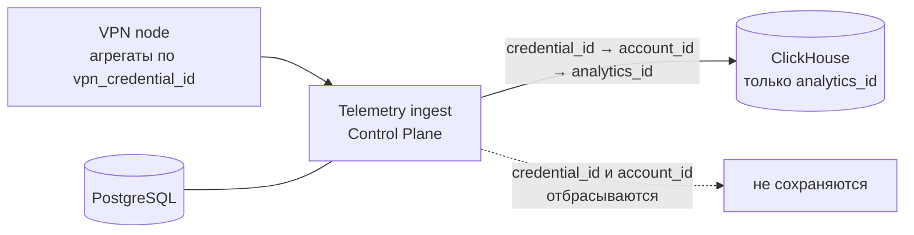
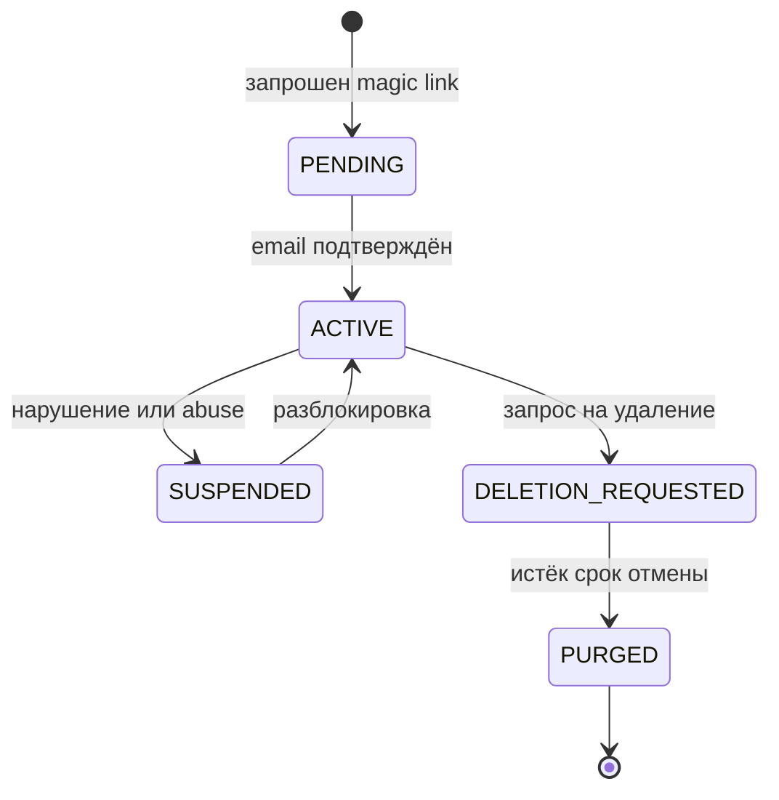

# Identity Model

Разделение идентификаторов — требование ТЗ 2.7. Документ фиксирует, какие идентификаторы существуют, кто их видит и какие связи запрещены.

## Идентификаторы

| Идентификатор | Формат | Кто выпускает | Время жизни | Назначение |
| --- | --- | --- | --- | --- |
| `account_id` | UUIDv4 | Control Plane | Пока существует аккаунт | Учётная запись, entitlement, биллинг |
| `device_id` | UUIDv4 | Клиент при первой установке | Пока установлено приложение | Лимит устройств, привязка сессии, revoke |
| `analytics_id` | 16 байт, производный | Control Plane, вычисляемый | Одна эпоха, по умолчанию 30 суток | Продуктовая аналитика |
| `vpn_credential_id` | UUIDv4, он же VLESS UUID | Control Plane | До ротации или отзыва | Аутентификация на ноде |
| `session_id` | UUIDv4 | Клиент | Одна VPN-сессия | Корреляция событий одной сессии |

Email существует только в контуре account и auth. Он не является идентификатором ни в одном другом контуре.

## Матрица Видимости

Строка — компонент, столбец — идентификатор. `+` означает «видит и имеет право хранить», `t` — «видит транзитно, хранить не имеет права», пусто — «не видит».

| Компонент | email | `account_id` | `device_id` | `analytics_id` | `vpn_credential_id` | `session_id` |
| --- | --- | --- | --- | --- | --- | --- |
| Android клиент | + | + | + | | + | + |
| Auth service | + | + | + | | | |
| Entitlement service | | + | + | | | |
| Fleet manager | | + | | | + | |
| Telemetry ingest | | t | | + | t | + |
| VPN node | | | | | + | |
| PostgreSQL | + | + | + | | + | |
| ClickHouse | | | | + | | + |
| Prometheus | | | | | | |
| Loki | | | | | | |

Два правила читаются прямо из матрицы:

1. **ClickHouse не содержит ни email, ни `account_id`, ни `device_id`, ни `vpn_credential_id`.** Единственный пользовательский ключ в аналитике — `analytics_id`.
2. **Нода не содержит ничего, кроме `vpn_credential_id`.** Изъятие ноды не даёт связи с человеком.

## Как Устроен `analytics_id`

```
analytics_id = HMAC-SHA256(K_epoch, account_id)[0:16]
```

- `K_epoch` — секретный ключ эпохи, живёт только в Control Plane
- эпоха по умолчанию 30 суток, длина настраивается через remote config
- при смене эпохи генерируется новый `K_epoch`
- ключ завершённой эпохи уничтожается после закрытия окна пересчёта

Что это даёт:

- внутри эпохи возможна вся требуемая per-user аналитика: heavy/light users, перцентили, top 1%, длительность сессий, reconnect rate
- после уничтожения `K_epoch` восстановить связь `analytics_id → account_id` нельзя даже при полном доступе к обеим базам
- склейка поведения одного человека между эпохами невозможна

Что это стоит:

- **cross-epoch retention-анализ per-user недоступен.** Это осознанный размен: приватность важнее когортного анализа на MVP. Если retention понадобится, он считается агрегированными счётчиками когорт без индивидуальных ключей, отдельным ADR.

## Как Устроен `vpn_credential_id`

- выпускается на пару `(account_id, node_id)`: один аккаунт на разных нодах имеет разные credential
- нода знает только его и не может связать credential с человеком
- ротация: по расписанию, при смене ноды, при подозрении на утечку, при отзыве устройства
- отзыв credential мгновенно отключает доступ на конкретной ноде, не затрагивая остальные

Разные credential на разных нодах означают, что компрометация одной ноды не даёт противнику работающий доступ к другим нодам того же аккаунта.

## Путь Телеметрии И Точка Обезличивания



Обезличивание происходит один раз, в Control Plane, на входе в аналитику. После этой точки исходные идентификаторы не сохраняются нигде в аналитическом контуре. Это единственное место, где связь существует, и она существует в памяти процесса в течение обработки батча.

Почему нельзя писать `vpn_credential_id` в ClickHouse напрямую: credential живёт дольше эпохи и является стабильным псевдонимом. Его наличие в аналитике сделало бы ротацию `analytics_id` бессмысленной.

## Запрещённые Связи

Ни один компонент, датасет, дашборд, лог или экспорт не имеет права содержать:

- `email` рядом с `analytics_id`
- `account_id` рядом с `analytics_id`
- `vpn_credential_id` рядом с `analytics_id`
- любую таблицу соответствия между эпохальными `analytics_id` разных эпох

Проверка этого правила должна стать автоматической на стадии реализации: схема ClickHouse не содержит соответствующих колонок, а тест проверяет отсутствие запрещённых полей в событиях ingest.

## Жизненный Цикл Аккаунта



При переходе в `PURGED`:

- удаляется email и все связанные с ним записи
- отзываются все `vpn_credential_id` аккаунта
- отзываются все `device_id`
- аналитические записи **не удаляются**, потому что они уже не связаны с человеком и не содержат идентификаторов, ведущих к нему

Последний пункт важен: именно обезличивание на входе делает удаление аккаунта полным без разрушения бизнес-метрик прошлых периодов.
