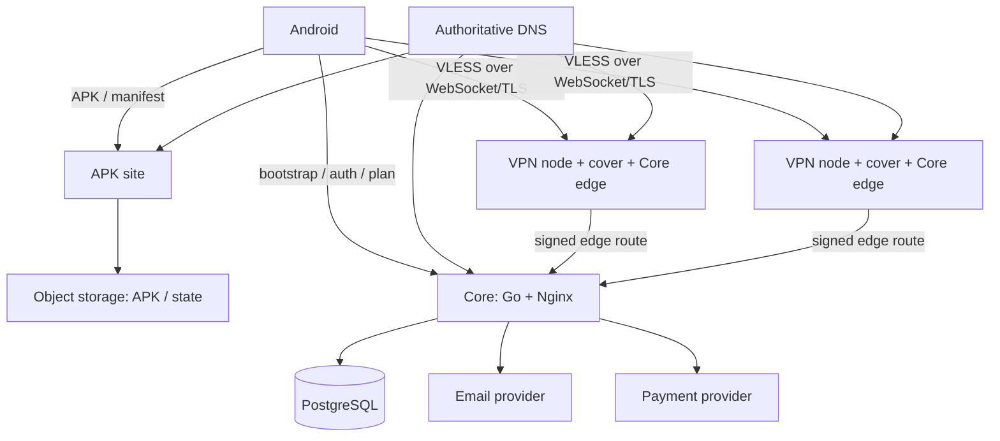

# Infrastructure

Документ описывает логическую топологию и технические инварианты. Провайдеры, регионы, домены, размеры машин, текущее состояние и команды восстановления находятся только в [операционной инструкции Business Owner](../business-owner-operations.md).

## Действующая логическая топология



Core и PostgreSQL находятся на одном хосте. Отдельного observability-host, выделенного DB-host и отдельных edge-машин сейчас нет. VPN-ноды одновременно несут пользовательский туннель, сайт-прикрытие и резервный путь в Core. Фактические имена и состав читаются в BO-инструкции и `Read The Panel`.

## Границы компонентов

| Компонент | Хранит состояние | Можно пересоздать без восстановления данных |
| --- | --- | --- |
| Core process и Nginx | Нет продуктового состояния вне PostgreSQL | Да |
| PostgreSQL | Аккаунты, планы, ноды, метрики, entitlement и платежи | Нет |
| VPN-нода | Только локальную конфигурацию и краткоживущие процессы | Да; ноды расходуемые |
| APK site | Нет: история APK и manifest находятся в object storage | Да |
| Object storage | Terraform state и APK; namespaces для будущих backup/log archive | Нет для state и единственных release artifacts |

Core остаётся единой точкой отказа для новых входов, refresh и управления. Клиент с последним валидным планом продолжает работу в `GRACE`; это ограничивает пользовательский эффект, но не заменяет резервирование. Инварианты будущего multi-Core описаны в [evolution.md](evolution.md).

## Сетевые правила

| Компонент | Публично | Управление |
| --- | --- | --- |
| Core | HTTPS API через Nginx | SSH/консоль; фактические firewall-ограничения — в BO-инструкции |
| VPN-нода | `443/tcp` cover + основной WebSocket/TLS; запасной transport port только при настройке | SSH разрешён только от Core; CI использует Core как jump host |
| APK site | `80/443` через Cloudflare; origin принимает Cloudflare | DigitalOcean Web Console; публичный SSH закрыт firewall |
| PostgreSQL | Не публикуется | Локально на Core host |
| Панель | Не публикуется | Читается штатным workflow через Core host |

Для доменов VPN-ноды Cloudflare proxy запрещён: он терминирует TLS и ломает сквозной WebSocket-туннель. Для APK-сайта proxy разрешён и является частью схемы.

## Provisioning и lifecycle

Штатная цепочка VPN-ноды:

```text
Add Server
  → provider instance
  → cloud-init: Nginx, Xray, node-agent и probe-agent
  → DNS и TLS
  → регистрация в Core
  → Node Inspect и проверки с Android
  → serving
```

Сервер не включается в выдачу только потому, что машина создана. Обязательны обе точки обзора: проверка с Core и проверка с пользовательского Android-устройства. Вывод выполняется через `draining` и `Retire Node`; старый IP/домен не восстанавливают как production-ноду.

Terraform state хранится удалённо. Образ и repository не содержат секретов или node-specific credentials. Любая постоянная машина сверх действующего инвентаря требует решения Business Owner; автомасштабирование платных ресурсов запрещено.

## Окружения

| Окружение | Назначение |
| --- | --- |
| `dev` | Локальные Go/PostgreSQL и Android tests; внешние провайдеры заменяются fake/adapters, где это возможно |
| Provider test mode | ЮKassa test store и диагностические workflows против реальных внешних API |
| `prod` | Один Core/DB host, расходуемый VPN fleet, APK site и внешние SaaS |

Отдельный постоянно работающий staging fleet сейчас не развёрнут. Изменения проходят тесты и provider-specific smoke checks, но этот компромисс нельзя описывать как полноценное staging-окружение.

## Резервное копирование и восстановление

Требуемый контракт:

| Данные | Требование |
| --- | --- |
| PostgreSQL | Шифрованная копия вне Core host и регулярно проверенный restore |
| Infrastructure configuration | Репозиторий + remote Terraform state; возможность import существующего ресурса |
| APK | Неизменяемые versioned objects и отдельный `latest`; release signing key имеет offline-копию у Business Owner |
| Технические журналы | Локальная ротация; при появлении архива — только безопасный формат без пользовательских адресов |
| Секреты | В CI/provider vault и offline recovery по отдельной процедуре, не в документации |

PostgreSQL backup, проверенный restore и архив journald **ещё не реализованы**. Наличие namespace в object storage не является backup. Текущий риск и порядок ручного восстановления зафиксированы в [BO-инструкции](../business-owner-operations.md#известные-операционные-пробелы) и [tech-debt.md](../tech-debt.md).

При потере нескольких компонентов порядок приоритета: PostgreSQL → Core → DNS/bootstrap → VPN-ноды → APK site → аналитическая история. VPN-ноды и APK site пересоздаются; Core data нельзя восстановить из нод.

## Форма затрат

Постоянные статьи — Core host, APK site/object storage, домены и внешние SaaS. Переменные — VPN fleet и трафик. Точная цена и живой provider inventory не фиксируются здесь; перед покупкой читаются provider bill и раздел роста нагрузки в BO-инструкции.
