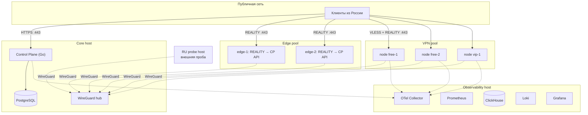

# Infrastructure

Инфраструктурная схема MVP. Документ описывает целевую топологию и правила, а не заказ ресурсов: ничего из перечисленного на стадии архитектуры не создаётся и не покупается, см. [prerequisites.md](prerequisites.md).

## Топология



Сплошные линии — публичный трафик. Пунктир — management-сеть WireGuard.

## Хосты MVP

| Роль | Количество | Что несёт | Почему так |
| --- | --- | --- | --- |
| Core | 1 | Control Plane, PostgreSQL, WireGuard hub | На объёмах MVP разделение Control Plane и БД не даёт выигрыша, но добавляет операционную стоимость |
| Observability | 1 | OTel Collector, Prometheus, ClickHouse, Loki, Grafana | Отделён от Core, чтобы всплеск аналитики не влиял на выдачу планов |
| Edge | 2+ | Xray REALITY, проксирование API Control Plane | Точки входа bootstrap; расходуемые |
| VPN node | по нагрузке | Xray REALITY, node-agent | Пулы `free`, `vip`, `quarantine` |
| RU probe | 1 | Внешняя проба доступности | Единственный способ увидеть блокировку из целевой сети |

Core и Observability — единственные хосты, которые не являются расходуемыми. Всё остальное создаётся и уничтожается по мере необходимости.

Core в MVP — единственная точка отказа выдачи новых планов. Это принято сознательно: клиенты с валидным планом продолжают работать в `GRACE`, см. [remote-config.md](remote-config.md), поэтому недоступность Core деградирует онбординг, а не связность существующих пользователей. Резервирование Core — задача стадии, следующей за запуском, а не MVP.

## Сетевые Правила

| Хост | Входящие разрешения | Всё остальное |
| --- | --- | --- |
| Core | `443/tcp` API, `51820/udp` WireGuard | Запрещено, включая SSH из публичной сети |
| Observability | Ничего из публичной сети | Только через WireGuard |
| Edge | `443/tcp` | Запрещено |
| VPN node | `443/tcp` | Запрещено |
| RU probe | Ничего | Только через WireGuard |

SSH доступен исключительно через management-сеть. Публичный SSH на любом хосте считается дефектом конфигурации.

Grafana и все дашборды не имеют публичного доступа: подключение через management-сеть. Публичная Grafana — типовой путь утечки операционных данных и списка нод.

## Требования К Разнообразию

Из [threat-model.md](threat-model.md) и [bootstrap-recovery.md](bootstrap-recovery.md):

- ноды и edge распределяются минимум по двум независимым провайдерам
- домены точек входа регистрируются минимум у двух регистраторов
- три ноды одного плана не должны находиться в одной подсети и по возможности у одного провайдера
- edge-ноды не размещаются в тех же подсетях, что и VPN-ноды

Провайдер выбирается с учётом того, что VPN-трафик и abuse-жалобы для части хостеров неприемлемы. Это фильтр при выборе, а не деталь эксплуатации.

## Provisioning

```
terraform apply
  → инстанс у провайдера
  → cloud-init: пакеты, node-agent, WireGuard, Xray
  → enroll в Control Plane одноразовым токеном
  → получение конфигурации
  → health checks
  → включение в пул
```

Правила:

- состояние Terraform хранится в удалённом зашифрованном бэкенде, не в репозитории
- образ не содержит секретов и не содержит конфигурации, специфичной для конкретной ноды
- добавление ноды — одна операция, запускаемая локально или из GitHub Actions
- удаление ноды — тоже одна операция, включающая отзыв credentials и удаление WG peer

## Окружения

| Окружение | Назначение | Состав |
| --- | --- | --- |
| `dev` | Локальная разработка | Docker Compose: Control Plane, PostgreSQL, ClickHouse; ноды заменяются моками |
| `staging` | Проверка изменений | Минимальный набор: Core, одна нода, один edge |
| `prod` | Продуктив | Полная топология |

Отдельный `staging` нужен не ради полноты, а потому что изменения конфигурации нод и подписи планов нельзя проверять на живых пользователях.

## Бэкапы И Восстановление

| Данные | Частота | Проверка |
| --- | --- | --- |
| PostgreSQL | Ежедневно, шифрованно, вне Core-хоста | Регулярное тестовое восстановление |
| Конфигурация инфраструктуры | В репозитории как код | Пересоздание из кода |
| ClickHouse | Реже, допускается потеря части аналитики | Не критично для работы сервиса |
| Секреты | По процедуре хранения | Проверка доступности резервной копии |

Порядок приоритетов при восстановлении: PostgreSQL, затем Control Plane, затем ноды, затем аналитика. Ноды восстанавливаются созданием новых, а не восстановлением старых.

## Форма Затрат

Точные суммы не фиксируются, потому что зависят от провайдера и трафика. Структурно затраты выглядят так:

| Статья | Характер | Драйвер роста |
| --- | --- | --- |
| Core + Observability | Постоянная | Практически не растёт на MVP |
| VPN-ноды | Переменная | Число пользователей и объём трафика |
| Edge-ноды | Малая постоянная | Число точек входа |
| RU probe | Малая постоянная | Нет |
| Домены | Малая постоянная | Число точек входа |
| Email, платежи | Переменная | Регистрации и оплаты |

Основной драйвер — трафик, поэтому классификация нагрузки и квоты FREE напрямую влияют на экономику, а не только на продукт.
