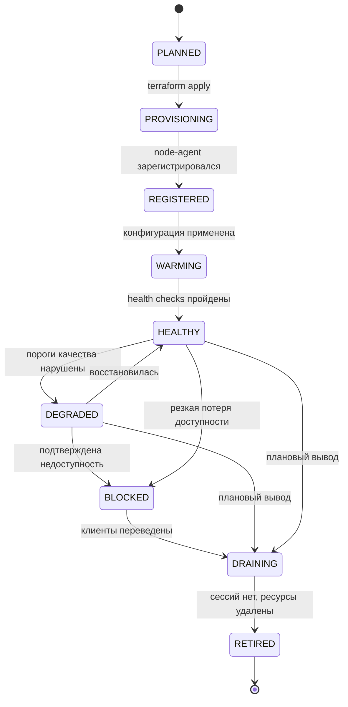
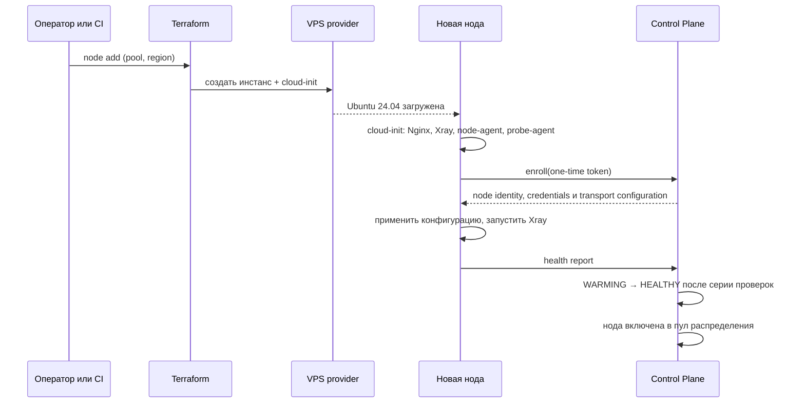

# Node Lifecycle

Реализация принципа ТЗ 2.3: нода и её IP — расходный ресурс. Документ описывает состояния ноды, штатную операцию замены и то, как система решает, что нода перестала работать.

## Состояния



| Состояние | Выдаётся новым аккаунтам | Обслуживает существующих | Комментарий |
| --- | --- | --- | --- |
| `PLANNED` | нет | нет | Запись в реестре, ресурса ещё нет |
| `PROVISIONING` | нет | нет | Создаётся провайдером |
| `REGISTERED` | нет | нет | Есть управляющий канал, нет конфигурации |
| `WARMING` | нет | нет | Проверки не завершены |
| `HEALTHY` | да | да | Рабочее состояние |
| `DEGRADED` | нет | да | Подозрение; существующие клиенты не выбрасываются мгновенно |
| `BLOCKED` | нет | нет | Клиенты уводятся на reserve |
| `DRAINING` | нет | доживают | Новых сессий нет |
| `RETIRED` | нет | нет | Ресурс удалён, IP освобождён |

Разница между `DEGRADED` и `BLOCKED` существенна. `DEGRADED` — это «перестаём наливать новых», `BLOCKED` — «уводим всех». Промежуточное состояние нужно, чтобы одиночный сетевой инцидент не приводил к массовой миграции пользователей, которая сама по себе выглядит как аномалия и создаёт нагрузку.

## Provisioning



Обязательные свойства процесса:

- **ни одного ручного шага по SSH.** Требование ТЗ. Добавление ноды — это одна операция, а не runbook из команд
- **enrollment token одноразовый и короткоживущий.** Он попадает в cloud-init, а значит потенциально виден провайдеру. Поэтому он не даёт ничего, кроме права один раз зарегистрироваться
- **нода не получает секретов из репозитория.** Всё, что нужно, выдаёт Control Plane после успешного enroll
- **конфигурация Xray не хранится в образе.** Она регенерируется из Control Plane при каждом старте, что делает изъятие диска менее ценным, см. [threat-model.md](threat-model.md)

Break-glass доступ по SSH существует как аварийный механизм, но он не является частью штатного процесса: его использование логируется, а нода после ручного вмешательства помечается как требующая пересоздания.

## Пулы

| Пул | Кому выдаётся | Зачем отделён |
| --- | --- | --- |
| `app` | Всем аккаунтам, FREE и VIP одинаково | Основной пул для подключений из приложения |
| `export` | VIP, для конфигураций сторонних клиентов | Экспортированная конфигурация может быть опубликована пользователем; изоляция ограничивает раскрытие |
| `edge` | Никому из пользователей | Точки входа bootstrap, см. [bootstrap-recovery.md](bootstrap-recovery.md) |
| `quarantine` | Аккаунты с признаком разведки | Изолирует перебор от рабочих мощностей |

Пул — свойство ноды, а не региона. Одна и та же физическая площадка может содержать ноды разных пулов, но одна нода принадлежит ровно одному пулу.

Разделения нод по уровням FREE и VIP нет: уровни различаются лимитами, а не инфраструктурой, см. [entitlement-model.md](entitlement-model.md). `export`-пул отделён не по признаку тарифа, а по признаку риска: конфигурация, покинувшая наше приложение, живёт по другим правилам.

Ожидаемое следствие: `export`-пул выгорает быстрее остальных. Это заложено, а не побочный эффект — его ноды заменяются чаще, и это нормальный режим.

## Распределение И Ёмкость

Fleet manager выбирает `primary` и два reserve при выдаче плана. Ограничения при выборе:

- нода в состоянии `HEALTHY`
- нода в пуле, соответствующем типу credential: `app` для приложения, `export` для сторонних клиентов
- транспорт ноды входит в множество, поддерживаемое клиентом. В MVP пересечение тривиально, но точка расширения существует с первого дня, см. И-13 в [evolution.md](evolution.md)
- `exposure_budget` ноды не исчерпан, см. [threat-model.md](threat-model.md)
- есть запас ёмкости: одновременные сессии и полоса ниже порогов
- три ноды плана не совпадают и по возможности не находятся в одной подсети и у одного провайдера

Закрепление липкое: повторный запрос плана возвращает те же ноды, пока сервер не решит иначе. Это одновременно и защита от перебора, и стабильность для пользователя.

Ёмкость ноды описывается тремя числами: `max_accounts`, `max_concurrent_sessions`, `max_mbps`. Значения — свойство типа инстанса и уточняются нагрузочными наблюдениями на следующих стадиях.

## Как Обнаруживается Нерабочая Нода

Три независимых сигнала. Ни один не используется в одиночку.

| Сигнал | Источник | Что видит | Слепая зона |
| --- | --- | --- | --- |
| Клиентский | Телеметрия connect success | Реальную доступность из сетей пользователей | Смешивает проблему ноды с проблемой сети клиента |
| Самодиагностика | node-agent | Живость процесса, ресурсы, исходящую связность | Не видит блокировку входящего трафика из России |
| Внешняя проба | Пробер из целевой сети | Достижимость `:443` снаружи | Требует площадки в целевой сети, см. [prerequisites.md](prerequisites.md) |

Комбинация решает главную проблему: нода может быть полностью здорова изнутри и при этом недоступна из России. Только клиентский сигнал и внешняя проба это видят.

Правила перехода:

- падение `connect_success` ниже порога **в нескольких сетевых сегментах одновременно** → `DEGRADED`
- падение только в одном сегменте → это событие сегмента, а не ноды; нода остаётся `HEALTHY`, событие уходит в отчёт по сегментам
- подтверждение внешней пробой или отсутствие успешных подключений в течение окна → `BLOCKED`
- восстановление требует выдержки: возврат в `HEALTHY` только после устойчивого окна успеха, чтобы избежать флаппинга

Пороги и окна задаются конфигурацией Fleet manager, а не зашиты в код: их придётся подбирать на реальных данных.

## Замена

Штатный сценарий из ТЗ:

```
Нода перестала работать
↓
DEGRADED / BLOCKED
↓
создаётся новая нода
↓
новый IP
↓
автоматическая настройка
↓
health check
↓
доступна клиентам
```

Реализация:

1. Fleet manager фиксирует состояние и перестаёт выдавать ноду новым аккаунтам
2. Запускается операция `node add` в тот же пул и, при возможности, у другого провайдера или в другой подсети
3. Существующие клиенты получают новый план при ближайшем refresh; клиенты, потерявшие связь, уходят на reserve сами
4. Нода переводится в `DRAINING`, затем в `RETIRED`, ресурс удаляется, IP освобождается

Полный autoscaling в MVP не требуется. Требуется, чтобы шаги 2–4 не содержали ручной установки и конфигурирования.

Целевой ориентир по времени замены — минуты, а не часы. Точное значение фиксируется после первых измерений на стадии инфраструктуры.

## Почему Ноды Расходуемые

Из [threat-model.md](threat-model.md) следует, что IP рано или поздно станет известен и может быть заблокирован. Архитектура не пытается это предотвратить. Она делает так, чтобы событие было дешёвым:

- нода не хранит уникального состояния — терять нечего
- credential привязаны к паре аккаунт-нода и отзываются точечно
- у клиента всегда есть два reserve, поэтому потеря ноды не означает потерю связности
- создание замены автоматизировано

Стоимость потери ноды равна стоимости инстанса и нескольких минут. Именно это соотношение делает стратегию работоспособной.
