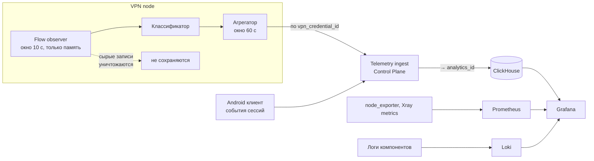

# Observability Data Model

Документ описывает, как получаются все метрики из ТЗ 2.5 и классификация нагрузки из ТЗ 2.6, не нарушая ограничений [privacy-model.md](privacy-model.md).

## Три Контура

| Контур | Хранилище | Ключ | Вопрос, на который отвечает |
| --- | --- | --- | --- |
| Метрики инфраструктуры | Prometheus | `node_id`, инстанс | Как себя чувствует железо и процессы |
| Технические логи | Loki | компонент, `node_id` | Что именно сломалось |
| Продуктовая аналитика | ClickHouse | `analytics_id` | Как ведут себя пользователи в агрегате |

Транспорт — OpenTelemetry Collector. Он же является местом, где применяются правила фильтрации: событие с запрещённым полем отвергается, а не очищается молча.

Разделение контуров не косметическое. В Prometheus нет пользовательских ключей вообще, поэтому его компрометация не даёт ничего о людях. В ClickHouse нет `node_id`-независимых связей с аккаунтом. Только Control Plane знает связь, и только в момент обработки батча.

## Путь Данных

Точка обезличивания одна — `Telemetry ingest`. Всё, что левее, работает с `vpn_credential_id`; всё, что правее, работает с `analytics_id`.

## Схемы ClickHouse

Схемы приведены как контракт данных, а не как финальный DDL.

### `session_events`

| Поле | Тип | Комментарий |
| --- | --- | --- |
| `ts` | DateTime | Время события |
| `analytics_id` | FixedString(16) | Эпохальный ключ |
| `session_id` | UUID | Одна VPN-сессия |
| `event` | Enum | `start`, `end`, `reconnect` |
| `node_alias` | LowCardinality(String) | Непрозрачный алиас |
| `tier` | Enum | `FREE`, `VIP` |
| `segment_class` | LowCardinality(String) | Класс сети, не IP |
| `app_version` | LowCardinality(String) | Версия сборки |
| `cohort` | LowCardinality(String) | Месяц регистрации, для агрегированного retention |
| `transport_kind` | LowCardinality(String) | Тип транспорта, инвариант И-15 |
| `duration_s` | UInt32 | Заполняется на `end` |
| `end_reason` | LowCardinality(String) | `user_off`, `network_lost`, `failover`, `error` |

### `traffic_agg`

| Поле | Тип | Комментарий |
| --- | --- | --- |
| `bucket_ts` | DateTime | Начало минутного окна |
| `analytics_id` | FixedString(16) | |
| `node_alias` | LowCardinality(String) | |
| `class` | Enum | Класс нагрузки, см. ниже |
| `bytes_up` | UInt64 | |
| `bytes_down` | UInt64 | |
| `flows` | UInt32 | Число потоков в окне |
| `active_s` | UInt16 | Секунд активности в окне |

Ни одного поля с адресом, доменом, портом назначения или содержимым. Это структурная гарантия: восстановить историю посещений из этой таблицы невозможно, потому что в ней нет соответствующих колонок.

### `connect_attempts`

| Поле | Тип | Комментарий |
| --- | --- | --- |
| `ts` | DateTime | |
| `analytics_id` | FixedString(16) | |
| `node_alias` | LowCardinality(String) | Пусто для попыток bootstrap |
| `entry_kind` | LowCardinality(String) | `https-direct`, `reality-edge`, `tunnel`, `rescue-mirror`, `rescue-code` |
| `transport_kind` | LowCardinality(String) | Инвариант И-15: без него не отличить отказ ноды от отказа транспорта |
| `segment_class` | LowCardinality(String) | |
| `result` | Enum | `success`, `timeout`, `refused`, `tls_error`, `auth_error` |
| `latency_ms` | UInt32 | |

Эта таблица — основной датчик блокировок. Она отвечает на три вопроса: жива ли нода, у какого сегмента проблемы и не отказывает ли сам транспорт. Последний вопрос определяет момент, когда пора вводить второй транспорт, см. [evolution.md](evolution.md).

## Сетевой Сегмент

`segment_class` — огрублённый признак сети клиента: класс оператора и укрупнённый регион. Требования:

- вычисляется на стороне Control Plane при приёме события, IP клиента при этом не сохраняется
- гранулярность выбирается так, чтобы в каждом классе было достаточно пользователей, иначе класс превращается в идентификатор
- классы с малой мощностью схлопываются в общий класс

Именно этот признак закрывает требование ТЗ «проблемы для отдельных сетевых сегментов», не сохраняя адресов пользователей.

## Классификация Нагрузки

### Что разрешено анализировать

Строго список из ТЗ 2.6: транспорт TCP/UDP/QUIC, bytes up/down, длительность, packet rate, распределение размеров пакетов, число одновременных соединений, отношение upload/download, burstiness, connection churn.

Не используется, хотя технически доступно: адрес назначения, порт назначения, SNI, DNS-имя. Их исключение снижает точность классификации, и это принятый размен: точность классов трафика не стоит риска для приватности.

### Как считается

1. Flow observer в node-agent наблюдает потоки в окне 10 секунд и держит только счётчики признаков — в памяти, без записи на диск.
2. Классификатор относит поток к одному из классов по правилам ниже.
3. Агрегатор суммирует по паре `(credential, class)` в минутное окно.
4. Сырые признаки потока уничтожаются по завершении окна. Максимальное время жизни — 60 секунд.

### Классы и опорные признаки

| Класс | Опорные признаки |
| --- | --- |
| `VIDEO_STREAMING` | Долгий поток, высокий и устойчивый down, крупные пакеты, циклическая burstiness с периодом единиц секунд, малое число соединений, up/down сильно асимметричен |
| `AUDIO_STREAMING` | Долгий поток, умеренный устойчивый down, пакеты среднего размера, низкая burstiness |
| `INTERACTIVE_WEB` | Много коротких потоков, высокий churn, короткие всплески с паузами, смешанные размеры пакетов |
| `P2P` | Много одновременных соединений, высокий churn, симметричные up/down, устойчивый upload, смесь TCP и UDP |
| `GAMING` | UDP, малые пакеты, высокий packet rate при низком объёме, долгая устойчивая сессия |
| `VOIP` | UDP, малые пакеты почти постоянного размера, регулярный интервал, симметричный объём |
| `DOWNLOAD` | Одно-два соединения, очень высокий устойчивый down, крупные пакеты, минимальный up, низкая burstiness |
| `BACKGROUND` | Малый объём, короткие периодические всплески, длинные паузы |
| `OTHER` | Не подошло ни под одно правило |

Пороги намеренно не зафиксированы числами: они подбираются на реальных данных на стадии реализации. Фиксирована структура — набор признаков, окна и выходные классы.

Метод для MVP — эвристические правила, а не машинное обучение. Причина: правила объяснимы, отлаживаются и не требуют обучающего датасета, собирать который означало бы хранить как раз то, что запрещено.

## Каталог Метрик Business Owner

| Требование ТЗ | Как считается | Источник |
| --- | --- | --- |
| Active users | uniq `analytics_id` за период | `session_events` |
| Concurrent sessions | Число открытых сессий по времени | `session_events` |
| Пики нагрузки | Максимумы по временным окнам | `traffic_agg` |
| Объём трафика | Сумма `bytes_up + bytes_down` | `traffic_agg` |
| Bandwidth | Производная объёма по времени | `traffic_agg`, Prometheus |
| Загрузка каждой node | CPU, память, сеть, сессии | Prometheus |
| Heavy / light users | Ранжирование `analytics_id` по объёму за эпоху | `traffic_agg` |
| P50 / P90 / P95 / P99 usage | Перцентили объёма на пользователя | `traffic_agg` |
| Top 1% traffic share | Доля верхнего процентиля в общем объёме | `traffic_agg` |
| Session duration | `duration_s` | `session_events` |
| Reconnect rate | Доля `reconnect` к числу сессий | `session_events` |
| Connect success | Доля `success` в попытках | `connect_attempts` |
| Latency | `latency_ms` и метрики ноды | `connect_attempts`, Prometheus |
| Packet loss | Метрики транспорта на ноде | Prometheus |
| Traffic mix | Доли классов | `traffic_agg` |
| Degraded / blocked nodes | Состояния из Fleet manager | Prometheus, Control Plane |
| Проблемы сетевых сегментов | Connect success в разрезе `segment_class` | `connect_attempts` |
| Агрегированный retention | uniq `analytics_id` по `cohort` в каждой эпохе, делённое на размер когорты | `session_events` |
| Здоровье транспорта | Connect success в разрезе `transport_kind` | `connect_attempts` |

Каждая строка достижима без единого запрещённого поля. Это и есть проверка того, что privacy-модель и требования Business Owner совместимы.

## Дашборды

| Дашборд | Аудитория | Содержание |
| --- | --- | --- |
| Business | Business Owner | Active users, сессии, объём, traffic mix, распределение нагрузки по пользователям |
| Fleet | Эксплуатация | Состояния нод, загрузка, ёмкость, кандидаты на замену |
| Connectivity | Эксплуатация | Connect success по нодам, точкам входа и сегментам сети |
| Quality | Эксплуатация | Latency, packet loss, reconnect rate |

## Retention

| Данные | Срок | Обоснование |
| --- | --- | --- |
| Сырые признаки потоков | ≤ 60 секунд, только память | Требование приватности |
| `traffic_agg`, `session_events`, `connect_attempts` | 13 месяцев | Годовое сравнение с запасом |
| Prometheus raw | 15 суток | Достаточно для расследования инцидента |
| Prometheus downsampled | 13 месяцев | Тренды по инфраструктуре |
| Loki | 14 суток | Диагностика, не аналитика |

Retention описывается как код и применяется автоматически. Ручное продление срока хранения для аналитического контура не предусмотрено.

## Дисциплина Кардинальности

- запрещены метки с неограниченным множеством значений в Prometheus: никаких `analytics_id`, `session_id`, IP
- `node_alias`, `segment_class`, `class`, `app_version` — единственные допустимые низкокардинальные метки в аналитике
- пользовательская гранулярность живёт только в ClickHouse, который для этого и предназначен
