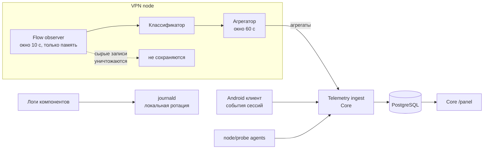

# Observability Data Model

Документ описывает privacy-safe модель данных и возможную классификацию нагрузки. Операционные показатели, панели и пороги находятся только в [BO-инструкции](../business-owner-operations.md#мониторинг-и-пороги-вмешательства).

## Что Построено На Самом Деле

Дальше разделы со схемами описывают переносимый контракт и могут содержать отложенные поля. Текущая реализация отличается в перечисленных ниже местах.

**Стека нет.** Prometheus, Grafana, Alertmanager, node_exporter, blackbox_exporter и OpenTelemetry Collector не разворачивались. Метрики живут в схеме `metrics` того же PostgreSQL, панель отдаёт сам Control Plane по пути `/panel`.

Причина не в экономии. Каждый компонент — это место, где может завестись запрещённая запись, а стадия требует проверять все логи и хранилища; пять компонентов означают пять аудитов, повторяемых при каждом обновлении. Меньше компонентов — это решение о приватности, а не о железе.

Порог, за которым отдельный сервис становится нужен, — около 20 нод при хранении 13 месяцев, когда запись метрик начнёт мешать выдаче планов. Схема написана так, чтобы переезд был сменой строки подключения: отдельная схема, ни одного запроса, соединяющего метрики с таблицами аккаунтов, агрегация на записи.

nDPI не подходит технически: Xray — userspace-прокси, трафик не появляется на интерфейсе в пригодном для DPI виде. blackbox_exporter не даёт российскую точку обзора, то есть не умеет именно того, ради чего был бы нужен.

**Классификация идёт маршрутизацией, а не формой потока.** Ниже записано, что адрес назначения и SNI не используются даже транзитно. Реализация использует имя в момент маршрутизации: каждый класс — обычный `freedom` outbound, отличающийся только именем, а остаётся число байт против класса.

Хранимый результат при этом идентичен: счётчик на класс, без пользовательского измерения. Точность выше, и на ноде не появляется наблюдатель пакетов — на одну обрабатывающую трафик деталь меньше. Стадия запрещает **хранить** SNI, а не видеть его.

Важнее того, что мы решили не хранить: Xray считает пользователей и исходящие независимо и не отдаёт их пересечение. Запрещённая связка «кто какой трафик создаёт» не запрещена — она недостижима.

**`analytics_id` привязан к началу месяца, а не к текущему моменту.** Иначе месяц одного человека распался бы на два ключа в день смены эпохи.

Что запрещённое не пишется, проверяют `node/check-privacy.sh` на ноде и тесты `control-plane/internal/store/schema_test.go` и `internal/api/shape_test.go`.

**Пути входа проверяет Android.** Обычный запрос останавливается на первом ответившем entry и потому не доказывает работоспособность остальных. Раз в шесть часов, а также сразу после первого входа, приложение в фоне получает последний подписанный bootstrap и обращается к `/v1/config` через каждый entry напрямую, без VPN. В отчёте три поля: публичный `host` нашего entry, успех и latency. URL запроса, посещённые адреса, IP пользователя и идентификатор аккаунта в таблицу probes не попадают. Core принимает `host` только если он находится в собственной таблице включённых bootstrap entries или нод; произвольная цель от изменённого APK отбрасывается.

## Логические Контуры И Текущая Реализация

| Контур | Хранилище | Ключ | Вопрос, на который отвечает |
| --- | --- | --- | --- |
| Метрики нод и продукта | PostgreSQL, схемы Core | `node_id` и обезличенные агрегаты | Как работает fleet и продукт |
| Технические логи | journald на хостах, без внешнего архива | компонент, `node_id` | Что именно сломалось |
| BO-представление | `/panel`, читаемая workflow `Read The Panel` | агрегаты без секретов | Состояние, ёмкость, connectivity и policy |

Телеметрию принимают Core endpoints. Событие с запрещённым полем отвергается, а не очищается молча; это проверяется API/schema tests.

ClickHouse, Loki, Prometheus, Grafana и OTel Collector не развёрнуты. Аналитика живёт в PostgreSQL, логи — только в journald. Namespace Spaces для архива подготовлен, но upload job отсутствует. Условия позднего перехода собраны в [deferred-stack-migration.md](deferred-stack-migration.md).

Разделение контуров не косметическое. В инфраструктурных метриках нет пользовательских ключей. В аналитических событиях нет адресов назначения и IP пользователя. Только Core кратковременно знает связь credential с account при проверке доступа.

## Путь Данных

Точка обезличивания одна — `Telemetry ingest`. Всё, что левее, работает с `vpn_credential_id`; всё, что правее, работает с `analytics_id`.

## Схемы Аналитики

Схемы ниже — первоначальный целевой контракт, а не точный DDL действующей PostgreSQL. Перед будущим ClickHouse нужен явный schema mapping и audit фактических migrations, см. [deferred-stack-migration.md](deferred-stack-migration.md).

### `session_events`

| Поле | Тип | Комментарий |
| --- | --- | --- |
| `ts` | DateTime | Время события |
| `analytics_id` | FixedString(16) | Эпохальный ключ |
| `session_id` | UUID | Одна VPN-сессия |
| `event` | Enum | `start`, `end`, `reconnect` |
| `node_alias` | LowCardinality(String) | Непрозрачный алиас |
| `tier` | Enum | `FREE`, `VIP` |
| `segment_class` | LowCardinality(String) | Класс сети, не IP |
| `app_version` | LowCardinality(String) | Версия сборки |
| `cohort` | LowCardinality(String) | Месяц регистрации, для агрегированного retention |
| `transport_kind` | LowCardinality(String) | Тип транспорта, инвариант И-15 |
| `duration_s` | UInt32 | Заполняется на `end` |
| `end_reason` | LowCardinality(String) | `user_off`, `network_lost`, `failover`, `error` |

### `traffic_agg`

| Поле | Тип | Комментарий |
| --- | --- | --- |
| `bucket_ts` | DateTime | Начало минутного окна |
| `analytics_id` | FixedString(16) | |
| `node_alias` | LowCardinality(String) | |
| `class` | Enum | Класс нагрузки, см. ниже |
| `bytes_up` | UInt64 | |
| `bytes_down` | UInt64 | |
| `flows` | UInt32 | Число потоков в окне |
| `active_s` | UInt16 | Секунд активности в окне |

Ни одного поля с адресом, доменом, портом назначения или содержимым. Это структурная гарантия: восстановить историю посещений из этой таблицы невозможно, потому что в ней нет соответствующих колонок.

### `connect_attempts`

| Поле | Тип | Комментарий |
| --- | --- | --- |
| `ts` | DateTime | |
| `analytics_id` | FixedString(16) | |
| `node_alias` | LowCardinality(String) | Пусто для попыток bootstrap |
| `entry_kind` | LowCardinality(String) | текущие `https-direct`, `https-ip`, `https-edge`; future rescue kinds расширяют список |
| `transport_kind` | LowCardinality(String) | Инвариант И-15: без него не отличить отказ ноды от отказа транспорта |
| `segment_class` | LowCardinality(String) | |
| `result` | Enum | `success`, `timeout`, `refused`, `tls_error`, `auth_error` |
| `latency_ms` | UInt32 | |

Эта таблица — основной датчик блокировок. Она отвечает на три вопроса: жива ли нода, у какого сегмента проблемы и не отказывает ли сам транспорт. Последний вопрос определяет момент, когда пора вводить второй транспорт, см. [evolution.md](evolution.md).

## Сетевой Сегмент

`segment_class` — огрублённый признак сети клиента: класс оператора и укрупнённый регион. Требования:

- вычисляется на стороне Control Plane при приёме события, IP клиента при этом не сохраняется
- гранулярность выбирается так, чтобы в каждом классе было достаточно пользователей, иначе класс превращается в идентификатор
- классы с малой мощностью схлопываются в общий класс

Именно этот признак закрывает требование ТЗ «проблемы для отдельных сетевых сегментов», не сохраняя адресов пользователей.

## Классификация Нагрузки

### Что разрешено анализировать

Строго список из ТЗ 2.6: транспорт TCP/UDP/QUIC, bytes up/down, длительность, packet rate, распределение размеров пакетов, число одновременных соединений, отношение upload/download, burstiness, connection churn.

Не используется, хотя технически доступно: адрес назначения, порт назначения, SNI, DNS-имя. Их исключение снижает точность классификации, и это принятый размен: точность классов трафика не стоит риска для приватности.

### Как считается

1. Flow observer в node-agent наблюдает потоки в окне 10 секунд и держит только счётчики признаков — в памяти, без записи на диск.
2. Классификатор относит поток к одному из классов по правилам ниже.
3. Агрегатор суммирует по паре `(credential, class)` в минутное окно.
4. Сырые признаки потока уничтожаются по завершении окна. Максимальное время жизни — 60 секунд.

### Классы и опорные признаки

| Класс | Опорные признаки |
| --- | --- |
| `VIDEO_STREAMING` | Долгий поток, высокий и устойчивый down, крупные пакеты, циклическая burstiness с периодом единиц секунд, малое число соединений, up/down сильно асимметричен |
| `AUDIO_STREAMING` | Долгий поток, умеренный устойчивый down, пакеты среднего размера, низкая burstiness |
| `INTERACTIVE_WEB` | Много коротких потоков, высокий churn, короткие всплески с паузами, смешанные размеры пакетов |
| `P2P` | Много одновременных соединений, высокий churn, симметричные up/down, устойчивый upload, смесь TCP и UDP |
| `GAMING` | UDP, малые пакеты, высокий packet rate при низком объёме, долгая устойчивая сессия |
| `VOIP` | UDP, малые пакеты почти постоянного размера, регулярный интервал, симметричный объём |
| `DOWNLOAD` | Одно-два соединения, очень высокий устойчивый down, крупные пакеты, минимальный up, низкая burstiness |
| `BACKGROUND` | Малый объём, короткие периодические всплески, длинные паузы |
| `OTHER` | Не подошло ни под одно правило |

Пороги намеренно не зафиксированы числами: они подбираются на реальных данных на стадии реализации. Фиксирована структура — набор признаков, окна и выходные классы.

Метод для MVP — эвристические правила, а не машинное обучение. Причина: правила объяснимы, отлаживаются и не требуют обучающего датасета, собирать который означало бы хранить как раз то, что запрещено.

## Показатели И Панели Business Owner

Единый каталог действующих показателей, нормальных значений и порогов вмешательства находится в [BO-инструкции](../business-owner-operations.md#мониторинг-и-пороги-вмешательства). В этом техническом документе он намеренно не повторяется.

## Retention

| Данные | Срок | Обоснование |
| --- | --- | --- |
| Сырые признаки потоков | ≤ 60 секунд, только память | Требование приватности |
| `traffic_agg`, `session_events`, `connect_attempts` | 13 месяцев | Годовое сравнение с запасом |
| journald на хосте | До локальной ротации по размеру | Внешнего архива сейчас нет; это открытый риск |

Retention PostgreSQL применяется серверным кодом. Retention будущего log archive не считается реализованным до появления upload/delete job и проверки восстановления.

## Дисциплина Кардинальности

- для любого будущего metrics backend запрещены метки с неограниченным множеством значений: никаких `analytics_id`, `session_id`, IP
- `node_alias`, `segment_class`, `class`, `app_version` — единственные допустимые низкокардинальные метки в аналитике
- пользовательская гранулярность живёт только в аналитическом хранилище, а не в метриках
