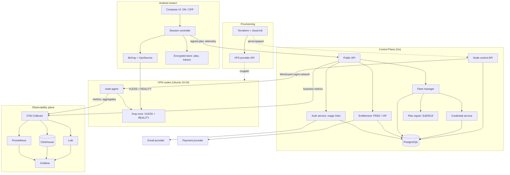
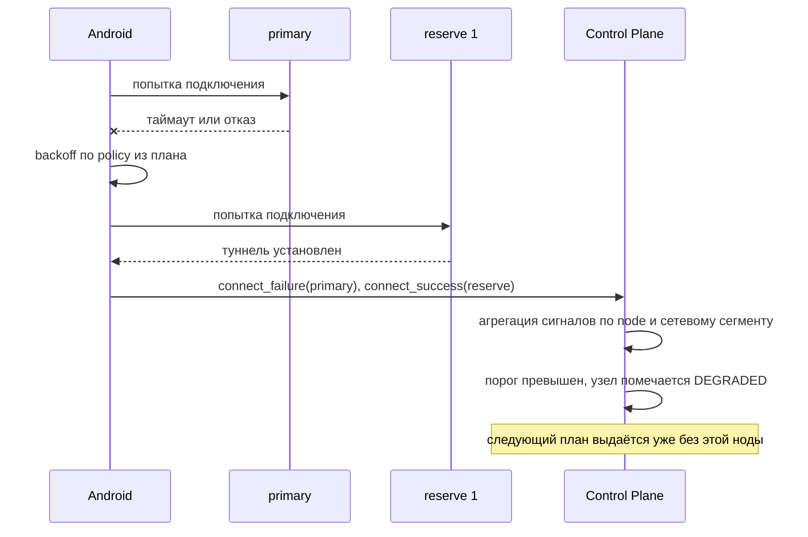

# Architecture Overview

Целевая архитектура MVP Android VPN. Документ задаёт компоненты, их границы и то, чего каждый компонент делать не должен.

Связанные документы: [threat-model.md](threat-model.md), [privacy-model.md](privacy-model.md), [identity-model.md](identity-model.md), [remote-config.md](remote-config.md), [bootstrap-recovery.md](bootstrap-recovery.md), [node-lifecycle.md](node-lifecycle.md), [observability.md](observability.md), [entitlement-model.md](entitlement-model.md), [secrets-model.md](secrets-model.md), [infrastructure.md](infrastructure.md), [failure-scenarios.md](failure-scenarios.md), [decisions.md](decisions.md).

## Формула Системы

```
Клиент ничего не решает.
Control Plane решает всё и подписывает решение.
Нода исполняет и ничего не помнит.
Аналитика видит агрегаты и не видит человека.
```

Каждое из четырёх утверждений — проверяемое ограничение, а не лозунг. Нарушение любого из них считается архитектурным дефектом.

## Диаграмма



Сплошные линии — трафик времени исполнения. Пунктир — операции provisioning.

## Границы Компонентов

### Android клиент

Отвечает за:

- email-логин по magic link и хранение session token
- запрос подписанного connection plan у Control Plane
- проверку подписи плана и anti-rollback по `seq`
- построение конфигурации Xray строго из полей плана
- подъём туннеля через `VpnService` и libXray
- failover на reserve-ноду по правилам, заданным сервером
- отправку агрегированной телеметрии

Не отвечает и не имеет права:

- выбирать ноду, страну, порт, DNS или routing самостоятельно
- хранить или отображать список fleet
- содержать в APK приватные ключи: в APK лежат только публичные ключи для проверки подписи
- принимать решение о деградации ноды — он только сообщает наблюдения
- показывать пользователю VLESS, REALITY, UUID, endpoint

Пользовательский путь ограничен: email → письмо → magic link → `ON`. Вторичное действие — `Получить VIP`. Всё остальное является следствием серверных решений.

### Control Plane

Отвечает за:

- аутентификацию по email и выдачу session/refresh токенов
- entitlement: FREE или VIP, квоты, срок действия
- реестр нод, их состояние и capacity
- размещение аккаунта на ноде и выдачу VLESS credential
- сборку и подпись connection plan: `primary` + 2 reserve
- remote config, kill-switch и минимально поддерживаемую версию приложения
- управление нодами через node-agent по management-сети
- приём агрегированной телеметрии и её нормализацию

Не отвечает и не имеет права:

- отдавать через публичный API полный fleet или его размер
- хранить browsing history, DNS, SNI, destination IP
- складывать email или `account_id` в аналитическое хранилище
- быть единственной точкой входа: у клиента обязан существовать путь восстановления, см. [bootstrap-recovery.md](bootstrap-recovery.md)

PostgreSQL — единственный source of truth для аккаунтов, entitlement, нод и credentials.

### VPN nodes

Отвечает за:

- терминацию VLESS + REALITY на `:443`
- применение конфигурации, полученной от Control Plane
- локальный расчёт агрегатов трафика и классификацию нагрузки
- health-репортинг и self-probe

Не отвечает и не имеет права:

- знать о существовании других нод
- писать access log, DNS log, SNI log
- хранить flow metadata дольше окна классификации
- видеть `account_id`, email или `analytics_id`: нода оперирует только `vpn_credential_id`
- принимать управляющие подключения из публичной сети — control-канал живёт только внутри WireGuard

### Observability plane

Отвечает за приём, хранение и визуализацию метрик, логов и агрегированной аналитики. Не отвечает за принятие решений: деградацию ноды объявляет Fleet manager, а не Grafana.

### Provisioning

Terraform + cloud-init + API провайдера создают ноду и приводят её к состоянию, в котором node-agent регистрируется в Control Plane. Ручная установка и конфигурирование через SSH не являются штатной операцией, см. [node-lifecycle.md](node-lifecycle.md).

## Основные Потоки

### Первый запуск


Пользователь совершает два действия: вводит email и нажимает `ON`. Всё между ними — серверная логика.

### Failover



Клиент не объявляет ноду мёртвой. Он сообщает факты и переключается по серверным правилам. Решение о состоянии ноды принимает Fleet manager на агрегате по многим клиентам: иначе один клиент за плохим каналом выводил бы ноду из эксплуатации.

## Что Намеренно Не Входит В MVP

| Не входит | Почему |
| --- | --- |
| Kubernetes | Нод десятки, а не тысячи; Terraform и node-agent проще и отлаживаемее |
| Kafka | Объём телеметрии MVP покрывается OTel Collector и батчами в ClickHouse |
| Elasticsearch | Полнотекстовый поиск по логам не нужен, Loki закрывает потребность |
| Redis cluster | Нет состояния, требующего распределённого кэша |
| Service mesh | Один Control Plane и ноды за WireGuard — mesh нечего решать |
| Микросервисы | Control Plane это один Go-бинарь с внутренними модулями |
| Автоматический autoscaling | По ТЗ не обязателен; обязательна штатная операция добавления ноды |
| Выбор страны или сервера в UI | Прямо запрещено ТЗ |

Каждый пункт может быть пересмотрен отдельным ADR при появлении измеренной причины.
