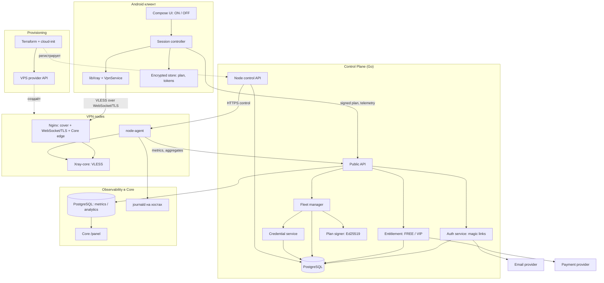
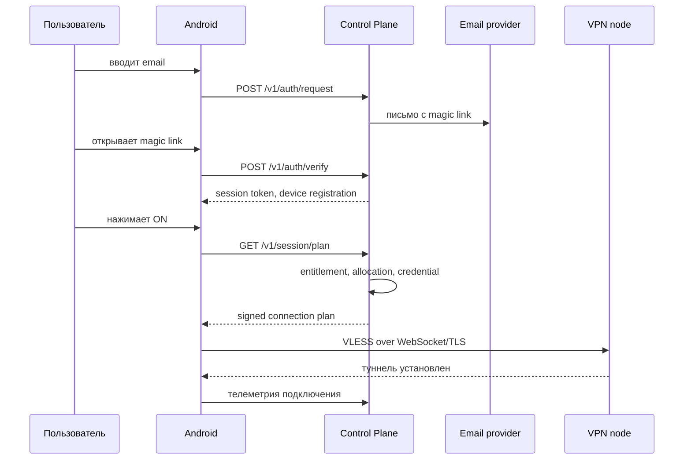
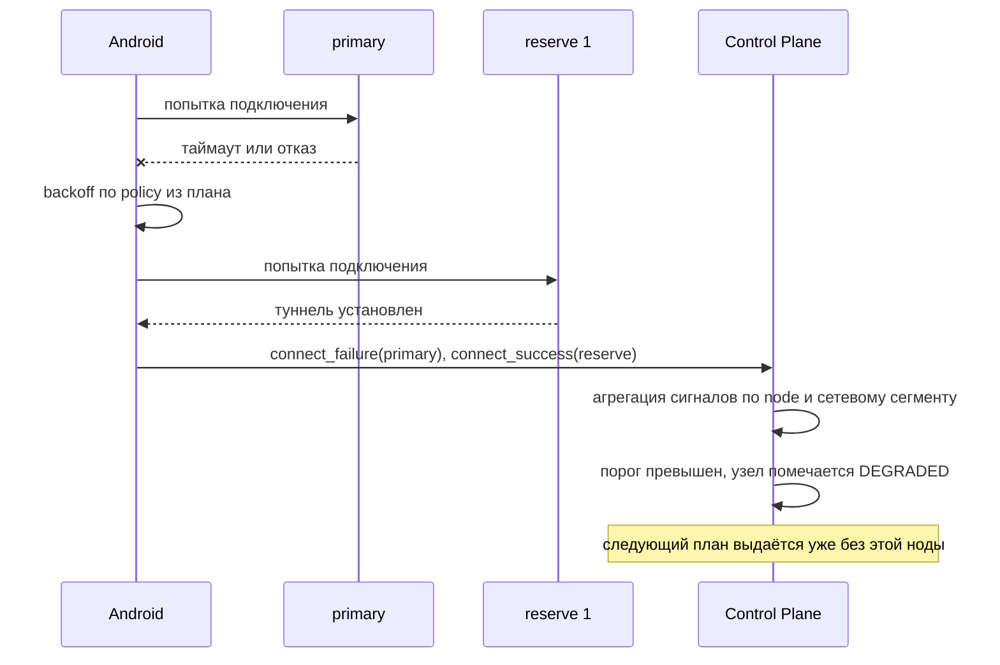

# Architecture Overview

Действующая логическая архитектура Android VPN. Документ задаёт компоненты, их границы и то, чего каждый компонент делать не должен. Физическое размещение и эксплуатация находятся только в [BO-инструкции](../business-owner-operations.md).

Связанные документы: [threat-model.md](threat-model.md), [privacy-model.md](privacy-model.md), [identity-model.md](identity-model.md), [remote-config.md](remote-config.md), [bootstrap-recovery.md](bootstrap-recovery.md), [node-lifecycle.md](node-lifecycle.md), [observability.md](observability.md), [entitlement-model.md](entitlement-model.md), [secrets-model.md](secrets-model.md), [infrastructure.md](infrastructure.md), [failure-scenarios.md](failure-scenarios.md), [decisions.md](decisions.md).

## Формула Системы

```
Клиент ничего не решает.
Control Plane решает всё и подписывает решение.
Нода исполняет и ничего не помнит.
Аналитика видит агрегаты и не видит человека.
```

Каждое из четырёх утверждений — проверяемое ограничение, а не лозунг. Нарушение любого из них считается архитектурным дефектом.

## Диаграмма



Сплошные линии — трафик времени исполнения. Пунктир — операции provisioning.

## Границы Компонентов

### Android клиент

Отвечает за:

- email-логин по magic link и хранение session token
- запрос подписанного connection plan у Control Plane
- проверку подписи плана и anti-rollback по `seq`
- построение конфигурации Xray строго из полей плана
- подъём туннеля через `VpnService` и libXray
- failover на reserve-ноду по правилам, заданным сервером
- отправку агрегированной телеметрии
- показ серверного каталога VIP и открытие выданного Core checkout во внешнем браузере
- применение подписанного latest/min verdict и исполнение выбранного update channel; для direct APK — download, SHA-256 и platform installer

Не отвечает и не имеет права:

- выбирать ноду, страну, порт, DNS или routing самостоятельно
- хранить или отображать список fleet
- содержать в APK приватные ключи: в APK лежат только публичные ключи для проверки подписи
- принимать решение о деградации ноды — он только сообщает наблюдения
- показывать пользователю transport params, UUID или endpoint в основном потоке
- хранить платёжные секреты, вычислять цену или активировать VIP по возврату браузера
- решать самостоятельно, обязательна ли новая версия, или устанавливать APK с неверным hash

Пользовательский путь ограничен: email → письмо → magic link → `ON`. Всё остальное является следствием серверных решений.

Два вторичных экрана вне основного потока:

- **экспорт конфигурации для VIP** — subscription-ссылка, QR или JSON для стороннего клиента. Это единственное место, где технические детали видны пользователю, и оно доступно только VIP, см. [entitlement-model.md](entitlement-model.md)
- **ввод кода восстановления** — появляется только после того, как исчерпаны все автоматические каналы входа, см. [bootstrap-recovery.md](bootstrap-recovery.md)

Оба экрана недоступны из обычного меню и не встречаются пользователю, у которого всё работает.

### Control Plane

Отвечает за:

- аутентификацию по email и выдачу session/refresh токенов
- entitlement: FREE или VIP, квоты, срок действия
- provider-neutral каталог и платежи; проверку канонического статуса у платёжного провайдера; однократную активацию срочного VIP
- реестр нод, их состояние и capacity
- размещение аккаунта на ноде и выдачу VLESS credential
- сборку и подпись connection plan: `primary` + 2 reserve
- remote config, kill-switch и минимально поддерживаемую версию приложения
- общую latest/min update policy, channel artifacts и серверный отказ старому app_version до выдачи VPN-плана
- управление нодами через node-agent и ограниченный management-доступ
- приём агрегированной телеметрии и её нормализацию

Не отвечает и не имеет права:

- отдавать через публичный API полный fleet или его размер
- хранить browsing history, DNS, SNI, destination IP
- складывать email или `account_id` в аналитическое хранилище
- быть единственной точкой входа: у клиента обязан существовать путь восстановления, см. [bootstrap-recovery.md](bootstrap-recovery.md)

PostgreSQL — единственный source of truth для аккаунтов, entitlement, нод и credentials.
Он же является source of truth для платежей и `vip_expires_at`; состояние внешнего checkout не применяется к доступу, пока Core не подтвердил его через server API провайдера.

### VPN nodes

Отвечает за:

- терминацию основного VLESS over WebSocket/TLS через Nginx на `:443`
- применение конфигурации, полученной от Control Plane
- локальный расчёт агрегатов трафика и классификацию нагрузки
- health-репортинг и self-probe

Не отвечает и не имеет права:

- знать о существовании других нод
- писать access log, DNS log, SNI log
- хранить flow metadata дольше окна классификации
- видеть `account_id`, email или `analytics_id`: нода оперирует только `vpn_credential_id`
- принимать SSH от произвольного публичного адреса; доступ разрешён только от Core, CI использует его как jump host

### Observability

Core/PostgreSQL принимают, хранят и показывают агрегированные метрики. Логи остаются в journald. Отдельного observability plane сейчас нет; деградацию ноды объявляет Fleet manager, а не панель.

### Provisioning

Terraform + cloud-init + API провайдера создают ноду и приводят её к состоянию, в котором node-agent регистрируется в Control Plane. Ручная установка и конфигурирование через SSH не являются штатной операцией, см. [node-lifecycle.md](node-lifecycle.md).

## Основные Потоки

### Первый запуск



Пользователь совершает два действия: вводит email и нажимает `ON`. Всё между ними — серверная логика.

### Покупка VIP

```mermaid
sequenceDiagram
    participant U as Пользователь
    participant A as Android
    participant CP as Core
    participant P as Payment provider

    A->>CP: POST /v1/payments {product_id}
    CP->>CP: FREE-период, switch продаж, серверная цена и срок
    CP->>P: создать redirect checkout
    P-->>CP: provider payment ID + HTTPS URL
    CP-->>A: provider-neutral pending payment
    A->>P: системный браузер
    P-->>CP: webhook как сигнал
    CP->>P: authenticated GET canonical payment
    CP->>CP: сумма + валюта + metadata + paid; применить VIP один раз
    A->>CP: перечитать состояние после возврата
```

Возврат страницы в Android ничего не подтверждает. Webhook также не является источником полей entitlement: он сообщает только ID объекта, после чего Core перечитывает объект по server API. ЮKassa — первый adapter общего payment provider contract; второй провайдер не меняет Android, аккаунты, VIP или VPN-доступы.

### Failover



Клиент не объявляет ноду мёртвой. Он сообщает факты и переключается по серверным правилам. Решение о состоянии ноды принимает Fleet manager на агрегате по многим клиентам: иначе один клиент за плохим каналом выводил бы ноду из эксплуатации.

## Что Намеренно Не Входит В MVP

| Не входит | Почему |
| --- | --- |
| Kubernetes | Нод десятки, а не тысячи; Terraform и node-agent проще и отлаживаемее |
| Kafka | Объём телеметрии покрывается прямым ingest Core и батчевой вставкой |
| Elasticsearch | Полнотекстовый поиск по логам не нужен |
| Redis cluster | Нет состояния, требующего распределённого кэша |
| Service mesh | Один Core и небольшой fleet — mesh нечего решать |
| Микросервисы | Control Plane это один Go-бинарь с внутренними модулями |
| Автоматический autoscaling | По ТЗ не обязателен; обязательна штатная операция добавления ноды |
| Выбор страны или сервера в UI | Прямо запрещено ТЗ |
| Подписки, автоплатежи, возвраты и продления VIP | Текущая покупка — разовый платёж на 1/3/12 месяцев; дальнейший lifecycle выделен в отдельные стадии |
| ClickHouse и Loki | Не помещаются в бюджет и в доступную память, `ADR-018` и `ADR-019`. Условия обратимости — в [deferred-stack-migration.md](deferred-stack-migration.md) |

Каждый пункт может быть пересмотрен отдельным ADR при появлении измеренной причины.

## Что Спроектировано Под Будущее, Но Не Реализуется Сейчас

Два ограничения MVP приняты как временные: один Core-хост и один VPN-транспорт. Чтобы «временное» не стало необратимым, условие переведено в шестнадцать инвариантов кода и схем данных в [evolution.md](evolution.md) — они соблюдаются с первой строки, не добавляя в MVP ни одного компонента.
