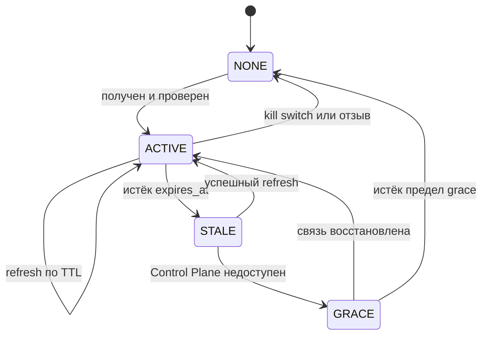

# Remote Config Model

Реализация принципа ТЗ 2.1: серверная часть определяет всё, клиент исполняет. Документ описывает два подписанных документа — `connection plan` и `remote config` — и правила их применения.

## Два Документа, Разные Роли

| Документ | Область | Кому | Обновление |
| --- | --- | --- | --- |
| `connection plan` | Конкретное подключение: ноды, credential, DNS, routing | Одному аккаунту и устройству | При запросе подключения и по TTL |
| `remote config` | Поведение приложения: флаги, пороги, кулдауны, минимальная версия | Всем клиентам или когорте | По расписанию и при старте |

Разделение нужно, чтобы менять поведение флота, не переиздавая индивидуальные планы, и наоборот — менять размещение пользователя, не трогая глобальные настройки.

## Connection Plan

```json
{
  "v": 1,
  "plan_id": "018f...",
  "seq": 42,
  "issued_at": "2026-08-21T10:00:00Z",
  "expires_at": "2026-08-22T10:00:00Z",
  "account_tier": "FREE",
  "primary": {
    "alias": "n-7f3a",
    "host": "203.0.113.10",
    "port": 443,
    "transport": {
      "kind": "vless-reality",
      "params": {
        "credential_uuid": "9c1d...",
        "flow": "xtls-rprx-vision",
        "server_name": "example-dest.com",
        "public_key": "base64...",
        "short_id": "1a2b3c4d",
        "fingerprint": "chrome"
      }
    }
  },
  "reserves": [
    { "alias": "n-2b91", "...": "те же поля" },
    { "alias": "n-c40e", "...": "те же поля" }
  ],
  "dns": {
    "mode": "tunnel",
    "servers": ["https://resolver.example/dns-query"]
  },
  "routing": {
    "profile": "default-ru",
    "rules": []
  },
  "policy": {
    "connect_timeout_ms": 8000,
    "failover_after_failures": 2,
    "reconnect_backoff_ms": [1000, 3000, 8000, 20000],
    "plan_refresh_after_s": 43200,
    "telemetry_sampling": 1.0,
    "probe_interval_s": 60
  }
}
```

Свойства, вытекающие из принципов:

- **ровно три ноды.** `primary` и два reserve. Ни одного поля, из которого можно судить о размере флота
- **`alias` непрозрачен.** Не порядковый номер, не имя хоста, не регион. Служит только ключом корреляции в телеметрии
- **`credential_uuid` различается по нодам.** Одна утечка не открывает доступ к двум нодам
- **нет ни одного поля, которое клиент мог бы «выбрать».** DNS, routing, таймауты, пороги failover заданы сервером
- **нет географии.** Клиент не знает страну ноды и не показывает её пользователю
- **транспорт — конверт, а не набор полей верхнего уровня.** Всё, что специфично для VLESS и REALITY, живёт внутри `transport.params`. Схема плана не знает о REALITY ничего, кроме строки `kind`

## Согласование Транспорта

Запрос плана содержит список транспортов, которые умеет данная сборка:

```json
{ "supported_transports": ["vless-reality"], "app_version": 3 }
```

Сервер выдаёт только то, что клиент умеет. Запись с неизвестным `kind` клиентом пропускается, а не приводит к отказу всего плана: это позволяет во время миграции выдавать смешанные планы, где `primary` на старом транспорте, а reserve на новом.

В MVP транспорт один, поэтому механизм тривиален. Он существует с первого дня по причине, изложенной в [evolution.md](evolution.md): ввести его задним числом означает обновить все установки одновременно, а это недостижимо.

## Remote Config

```json
{
  "v": 1,
  "seq": 17,
  "issued_at": "2026-08-21T10:00:00Z",
  "min_supported_app_version": 3,
  "update": {
    "latest_version_code": 5,
    "latest_version_name": "0.5.0",
    "min_supported_version_code": 3,
    "channels": {
      "direct_apk": {
        "url": "https://simple-vpn.download/download/releases/0.5.0/simple-vpn-0.5.0.apk",
        "sha256": "64 lowercase hex characters"
      }
    }
  },
  "kill_switch": { "enabled": false, "message_key": "" },
  "auth": {
    "magic_link_ttl_s": 900,
    "first_plan_cooldown_s": 120,
    "request_rate_per_email_per_hour": 3
  },
  "features": {
    "config_export_enabled": true,
    "traffic_classification_enabled": true
  },
  "telemetry": {
    "batch_interval_s": 60,
    "max_batch_events": 200
  },
  "bootstrap": { "see": "bootstrap-recovery.md" }
}
```

`kill_switch` существует, чтобы при инциденте остановить подключение клиентов централизованно, не дожидаясь обновления APK. Корневой `min_supported_app_version` сохранён для уже выпущенных клиентов и совпадает с `update.min_supported_version_code`.

`current < min` означает обязательное обновление и запрет нового connection plan; `min <= current < latest` — добровольное обновление без ограничения VPN. Отдельного mandatory-флага нет, поэтому два поля не могут противоречить друг другу. Latest/min общие для каналов, а `channels` содержит только способ исполнения. Публикация APK меняет latest/direct artifact после публичной проверки и не повышает min.

## Подпись И Проверка

Оба документа доставляются в конверте:

```json
{
  "payload_b64": "...",
  "alg": "ed25519",
  "key_id": "cp-2026-08",
  "sig_b64": "..."
}
```

В APK вшиты публичные ключи Control Plane — минимум два, чтобы ротация ключа не требовала выпуска приложения. `key_id` выбирает, каким из них проверять.

Алгоритм проверки на клиенте, в этом порядке:

1. `key_id` известен и не отозван, иначе документ отбрасывается
2. подпись валидна для `payload`, иначе отбрасывается
3. `v` поддерживается текущей версией приложения
4. `seq` больше последнего успешно применённого для этого типа документа, иначе отбрасывается как rollback
5. `expires_at` не в прошлом с учётом допуска на расхождение часов
6. схема полна: отсутствие обязательного поля делает документ невалидным целиком, частичное применение запрещено
7. только после всех проверок документ сохраняется и применяется

Проверка подписи первична по отношению к транспорту. Это то, что позволяет принимать конфигурацию по недоверенным каналам восстановления — см. [bootstrap-recovery.md](bootstrap-recovery.md).

## Anti-Rollback

`seq` монотонно растёт на стороне Control Plane отдельно для каждого типа документа и для каждого аккаунта в случае плана. Клиент хранит последний применённый `seq` в защищённом хранилище.

Источник монотонности — транзакция в PostgreSQL, а не счётчик в памяти процесса. Это инвариант И-2 из [evolution.md](evolution.md): при появлении второго экземпляра Control Plane счётчик в памяти привёл бы к выпуску документов с одинаковым или убывающим `seq`, и клиенты начали бы отбрасывать валидную конфигурацию как попытку отката.

Что это закрывает: противник, записавший старый валидно подписанный план, не может позже навязать его повторно, чтобы вернуть клиента на уже заблокированную или скомпрометированную ноду.

Что это не закрывает: полная переустановка приложения сбрасывает состояние. Ответ — короткий `expires_at` у плана: просроченный план не применяется независимо от `seq`.

## Расхождение Часов

Клиент не доверяет системным часам устройства как единственному источнику. При проверке `expires_at` применяется допуск, а фактическая свежесть подтверждается ответом Control Plane при ближайшем успешном обращении. Если план просрочен, а Control Plane недоступен, клиент действует по правилу деградации из [failure-scenarios.md](failure-scenarios.md), а не отключает пользователя молча.

## Жизненный Цикл Плана



`GRACE` — состояние, в котором клиент продолжает пользоваться последним валидным планом, пока Control Plane недоступен. Без него временная недоступность Control Plane означала бы отключение всех пользователей, что превращает Control Plane в единую точку отказа для уже работающих клиентов.

## Что Клиент Не Имеет Права Делать

- достраивать конфигурацию Xray полями, которых нет в плане
- пробовать ноды не из плана
- менять DNS или routing по локальной эвристике
- продолжать использовать ноду, помеченную сервером как изъятая, после успешного получения нового плана
- кэшировать более одного валидного плана одновременно

Любое из этих действий делает клиента субъектом принятия решений и нарушает принцип 2.1.
