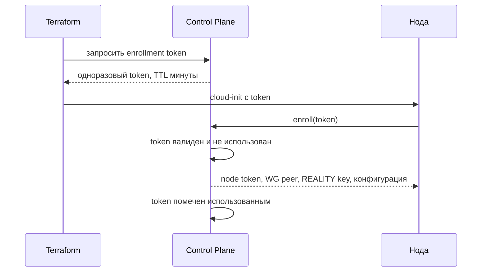

# Secrets Model

Документ фиксирует, какие секреты существуют, где они рождаются, кто имеет к ним доступ и что происходит при компрометации каждого.

## Четыре Правила

1. **В APK нет ни одного секрета.** Только публичные ключи для проверки подписи. Обоснование — [threat-model.md](threat-model.md): APK считается декомпилированным.
2. **В репозитории нет ни одного секрета.** Ни в коде, ни в конфигурации, ни в Terraform-переменных, ни в истории коммитов.
3. **Нода не получает секретов из образа или из репозитория.** Всё выдаёт Control Plane после успешного enroll.
4. **Секрет, прошедший через переписку, считается скомпрометированным.** Чат, тикет, мессенджер и почта не являются каналом передачи секретов: они логируются, индексируются и хранятся дольше, чем предполагает отправитель. Такой секрет отзывается и выпускается заново, а новое значение вводится напрямую в целевое хранилище.

Правило 4 действует независимо от того, кому и зачем секрет был отправлен. Оно дешёвое: отзыв и перевыпуск API-ключа занимают минуту, а оценка того, «насколько сильно» секрет засветился, не занимает ничего, потому что достоверно её выполнить нельзя.

## Реестр Секретов

| Секрет | Где рождается | Где хранится | Кто использует | Ротация | Что даёт компрометация |
| --- | --- | --- | --- | --- | --- |
| APK signing key | У Business Owner | Вне CI, офлайн-хранилище | Сборка релиза | Не ротируется, замена = новое приложение | Подмена приложения. Наивысший ущерб |
| Plan signing key (Ed25519) | Control Plane | Отдельно от БД, ограниченный доступ процесса | Plan signer | Плановая, по `key_id` | Подмена конфигурации у всех клиентов |
| Публичные ключи в APK | Производные от plan signing key | В коде приложения | Клиент | Через выпуск сборки | Ничего, они публичны |
| Node enrollment token | Control Plane | Одноразово в cloud-init | Новая нода | Одноразовый, TTL минуты | Возможность зарегистрировать чужую ноду один раз |
| Node token | Control Plane | На ноде, файл с ограниченными правами | node-agent | При пересоздании ноды | Управляющий доступ к одной ноде |
| WireGuard keys | Нода и Control Plane | На соответствующих сторонах | Management network | При пересоздании ноды | Доступ в management-сеть с одной ноды |
| REALITY private key | Control Plane, на ноду | На ноде, только в рантайме | Xray | При пересоздании или подозрении | Возможность выдать себя за ноду |
| VPN credentials | Control Plane | PostgreSQL и конфигурация ноды | Xray, клиент | Плановая и по событию | Бесплатное использование конкретной ноды |
| DB credentials | Оператор | Secrets store среды | Control Plane | Плановая | Полный доступ к аккаунтам. Критично |
| Analytics epoch key `K_epoch` | Control Plane | Только в памяти и защищённом хранилище | Обезличивание | Каждую эпоху, старый уничтожается | Возможность связать `analytics_id` с аккаунтом в текущей эпохе |
| VPS provider API token | Провайдер | GitHub Secrets, среда Terraform | Provisioning | Плановая | Создание и удаление инфраструктуры |
| DNS provider API token | Провайдер | GitHub Secrets | Управление доменами | Плановая | Перехват доменов |
| Email provider key `BREVO_API_KEY` | Провайдер | GitHub Secrets, позже — secrets store среды | Auth service | Плановая и при подозрении | Рассылка от нашего имени, перехват magic links |
| Email webhook path secret | Control Plane | Secrets store среды | Обработчик webhook | Плановая | Возможность слать поддельные события доставки |
| Payment provider keys | Провайдер | Secrets store среды | Billing | Плановая | Финансовые операции |
| Firebase service account | Google | GitHub Secrets | Распространение сборок | Плановая | Раздача поддельной сборки тестерам |

Строки с наивысшим приоритетом защиты: APK signing key, DB credentials, plan signing key. Компрометация любого из трёх не лечится ротацией нод.

## Хранение

| Контур | Механизм | Комментарий |
| --- | --- | --- |
| CI | GitHub Secrets | Только то, что нужно сборке и provisioning |
| Control Plane runtime | Secrets store среды с ограниченными правами доступа | Для MVP достаточно файлов с жёсткими правами и шифрованного диска; полноценный vault — отдельное решение |
| Ноды | Файлы с правами `0600`, владелец — сервисный пользователь | Минимум durable-состояния |
| Terraform state | Удалённый бэкенд с шифрованием | State содержит чувствительные атрибуты и не хранится в репозитории |
| APK | Ничего | По правилу 1 |

Конкретный механизм секретов для Control Plane фиксируется `ADR-007` в [decisions.md](decisions.md). Архитектурное требование: секрет не должен попадать в аргументы командной строки, в логи и в переменные окружения дочерних процессов, которым он не нужен.

## Выдача Секретов Ноде

Почему так: cloud-init виден провайдеру и может сохраниться в его панели. Поэтому в него попадает только одноразовый и короткоживущий артефакт, ценность которого после регистрации равна нулю.

## Ротация

| Секрет | Триггер | Как проходит без простоя |
| --- | --- | --- |
| Plan signing key | Расписание или подозрение | Новый `key_id` подписывает, старый публичный ключ ещё принимается клиентами до истечения переходного окна |
| VPN credentials | Расписание, смена ноды, подозрение | Новый credential приходит с новым планом, старый отзывается после перехода |
| `K_epoch` | Каждая эпоха | Новый ключ с началом эпохи, старый уничтожается после закрытия окна |
| Node token, WG, REALITY | Пересоздание ноды | Ноды расходуемые, ротация = замена |
| Provider и SaaS токены | Расписание | Замена в secrets store, перезапуск потребителя |
| DB credentials | Расписание | Параллельная учётная запись, затем вывод старой |

Общее правило: сначала вводится новое, потом выводится старое. Обратный порядок означает простой.

## Компрометация: Что Делать

| Событие | Немедленные действия |
| --- | --- |
| Утечка plan signing key | Выпуск нового `key_id`, отзыв старого через remote config, ускоренный refresh планов, оценка необходимости новой сборки |
| Утечка DB | Смена всех DB credentials, оценка объёма раскрытия email, уведомление пользователей, ротация `K_epoch` |
| Изъятие ноды | `BLOCKED`, отзыв её credentials, удаление WG peer, пересоздание, разбор причин |
| Утечка provider token | Отзыв в панели провайдера, аудит созданных и удалённых ресурсов |
| Утечка email provider key | Отзыв, проверка отправленных писем, инвалидация активных magic links |
| Утечка APK signing key | Максимальный инцидент: новое приложение, уведомление, kill switch для старых версий |

## Что Проверяется Автоматически

- сканирование репозитория и истории на секреты в CI
- запрет на коммит файлов, попадающих под правила `.gitignore` для секретов
- тест: сборка APK не содержит строк из реестра приватных секретов
- тест: конфигурация ноды, сгенерированная Control Plane, не содержит полей, которых там быть не должно
- периодический аудит доступов к GitHub Secrets и к панелям провайдеров

## Ключи Подписи Control Plane

Созданы 2026-08-25. Это самый чувствительный секрет проекта: он позволяет выдать любому установленному приложению любую точку входа.

| Что | Где | Публичность |
| --- | --- | --- |
| `CP_SIGNING_SEED_A` | секрет репозитория | приватный |
| `CP_SIGNING_SEED_B` | секрет репозитория | приватный |
| Публичные половины | `config/TrustedKeys.kt`, вшиты в APK | публичны по построению |

Идентификаторы: `cp-2026-08-a` и `cp-2026-08-b`. `key_id` в подписанном документе выбирает, каким проверять.

### Почему Ключей Два

Один ключ невозможно ротировать. Вывод его из обращения потребовал бы, чтобы **сначала** обновились все установки, а обновление доходит до пользователей днями, тогда как скомпрометированный ключ — проблема минут.

С двумя ключами один выводится из обращения, пока второй продолжает подписывать, а замена уезжает в следующем релизе без спешки.

### Как Они Появились

Пара сгенерирована локально, приватные части записаны прямо в хранилище секретов конвейера, локальные копии уничтожены в том же шаге. В репозиторий приватная часть не попадала ни разу — не «была удалена», а не попадала.

Публичные части лежат в открытом виде в коде приложения. Так и должно быть: они уезжают в каждую установку и секретом не являются.

### Что Ключ Не Привязан К Машине

Приватный ключ живёт в секретах конвейера, а не на сервере Control Plane. Следствие, ради которого так и сделано: Control Plane, поднятый на другой машине из того же конвейера, выпускает документы, которые установленные приложения примут без обновления. Машина заменима, ключ — нет. См. [control-plane-capacity.md](control-plane-capacity.md).

### Правило Проверки На Клиенте

Неизвестный `key_id` — это **отброшенный документ**, а не документ, принятый без проверки. Ключ, который не удалось разобрать, тоже не ключ: клиент считает документ непроверяемым, потому что альтернатива — доверять байтам, которые никто не смог разобрать.
